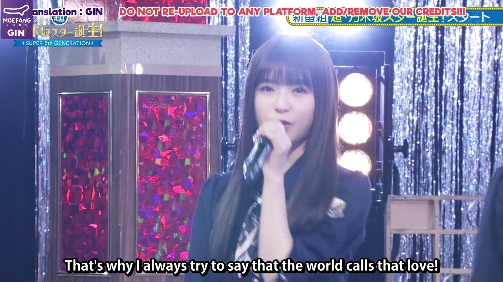

# Hardsubs are Unethical

## Understanding Hardsubs and Their Limitations

Hardcoding subtitles, or "hardsubs", is a process that overlays text onto video frames during encoding, resulting in a single, inseparable file. This practice, while suitable for streaming, introduces a significant risk factor: data fragility. If the video file is lost or corrupted, the subtitles are lost as well. 

A notable example of this fragility occurred in September 2021, when a [Google Drive security update led to numerous broken file links](https://support.google.com/drive/answer/10729743?hl=en). This event resulted in a significant amount of lost content, demonstrating the inherent vulnerability of hardsubs. Many links in the Nogizaka Masterlist[^1] and many other google related archives are now completely unnaccessible.

Hardsubs also present issues with accessibility and quality control. They cannot be resized, recolored, or repositioned to accommodate individual viewer needs, nor can they be read with text-to-speech applications. Once subtitles are embedded into a video, any errors in translation or timing become permanent, and the process of correcting these mistakes post-production is effectively impossible.

## The Ethical Implications of Hardsubs

The act of hardsubbing is inherently anti-otaku as it defies doujin culture[^2]. It prevents the creation of procedural derivative works, which is a key aspect of otaku culture. For example, a fan might want to create their own fansub with a different translation or interpretation of the dialogue, or change it to another language entirely, but to do so they would require some sort of approval from the original subber. 

Notice too that some fansubbers and fansub groups attempt to copyright their created subtitles (__img_1__, __img_2__), despite the fact that the content they are subtitling is often copyrighted material that they do not own. This creates a paradox where they are breaking copyright laws while also enforcing their own copyrights, which can only be the result of extreme stupidity or an openly malicious intention.

*img_1: Imagine Subs showing how much they care about their immoral copyright claim, even if it means total loss of information, or how they call it: a mere inconvenience*

*img_2: GinSubs is also another subber whose final product is completely covered in watermarks often reinforcing his supposed ownership of it.*

## A Peaceful Solution

In an ideal world all fansub groups would understand this post and proceed ethically, doing an honest-to-god work by commiting to at least release their translations as a simple .ASS file as an option, even if they decide to move on with these disgraceful watermarked content for any reason.

Softsubs, or non-hardcoded subtitles, present a solution to the issues posed by hardsubs as they allow for the information to be remodeled and redesigned as desired without risking the original content from being lost. They also provide viewers with the ability to adjust the subtitles to their individual needs and all the other points regarding accessibility I have mentioned before.

## A Less Peaceful Solution

But what to do if ethics cannot be simply achieved by a consensual realization that the current situation is evidentially wrong? It must be enforced.

Subtitles can be extracted from any hardcoded video with two simple programs: [VideoSubFinder](https://sourceforge.net/projects/videosubfinder/) and [SubtitleEdit](https://www.nikse.dk/subtitleedit). VideoSubFinder is used to export the frames as very clean images containing only the subtitles, then SubtitleEdit's built-in OCR function[^3] is used to transform that into perfectly timed subtitles. After running it, all that's left is to curate the results, clean it, and then it can be published and shared.

## Conclusion

While there was a time when hardcoding subtitles was the best way to share information through pirate networks, the internet has evolved to handle more data. It's necessary for fansubbers to become aware of the risks they are imposing on their own work and in the culture in general. 

Moreover, the shift from hardsubs to softsubs presents an opportunity to preserve old media that is on the brink of being lost forever. By extracting and separately storing subtitles, we can ensure the longevity of these materials and protect them from potential data loss or corruption. This not only safeguards the work of fansubbers but also contributes to the preservation of non-japanese otaku culture as a whole.

**This is a Work In Progress**

**TO-DO:**

1. Articulate a defense against the notion that having poor quality subtitles is preferable to having none at all.
2. Highlight the rapid development of Automatic Speech Recognition (ASR) systems and how this progress will eventually eliminate the scarcity of subtitles. 
3. Use actual instances to support the argument, such as the case of the Nogizaka Skits Blu-ray release. Discuss how the availability of Tamuhaya's translation could have expedited the subbing process.
4. Analyze what fansubbers gain from unethically copyrighting their work. This could include recognition, control over content, or potential financial benefits.
5. Discuss other unethical practices within the fansubbing community, such as paywalling content, using ad-filled and vulnerable websites with little regard for user safety, etc.
6. Compile a list of fansubbers within the Nogizaka46 community who are known for their ethical practices.
7. Recently I've come to notice an issue presented by subbers of tv shows: big sites, such as dramakiss as an example, stealing their subs and profiting off of it. I'll be thinking about this.

## Further Readings

1. [EXTORTION INDUSTRY](https://extortionindustry.org/extortion)

## Footnotes

[^1]: Large parts of the community still organize and share content in giant collectively managed spreadsheets, where fansub groups go to share and store links to specific episodes and events.

[^2]: Doujin can best be defined as independent derivative work made by the members of a specific fanbase. In this context, hardsubbing is seen as anti-otaku because it prevents the creation of procedural derivative works.

[^3]: It uses Tesseract-OCR.