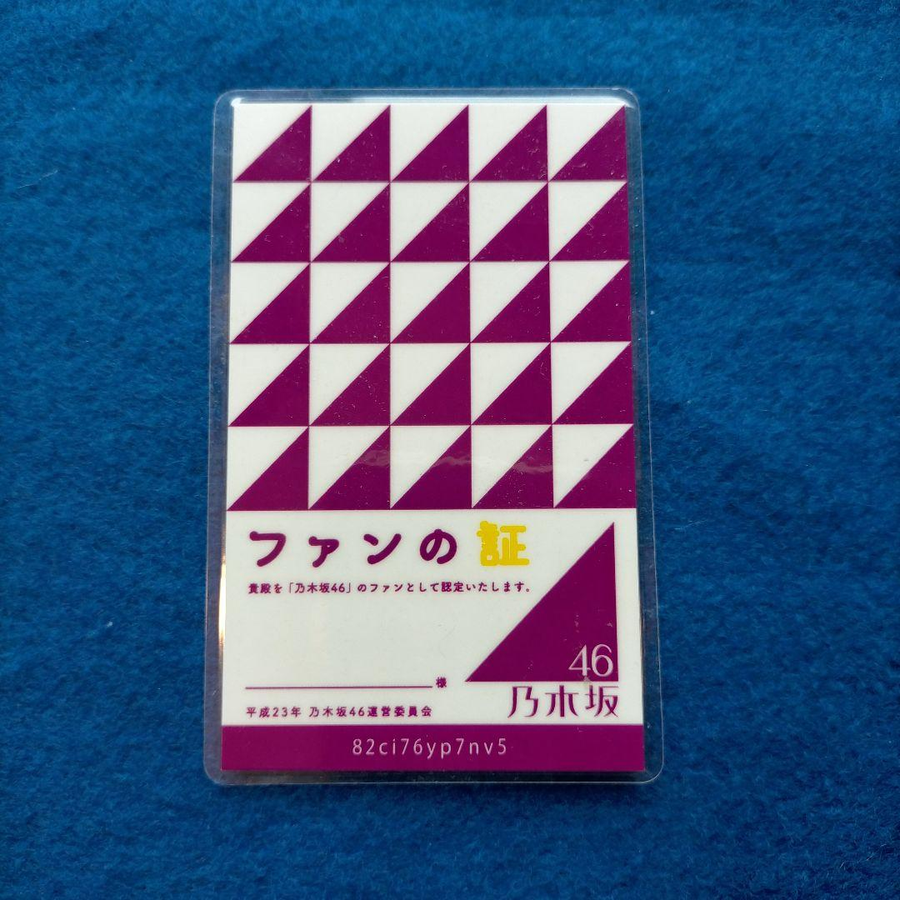
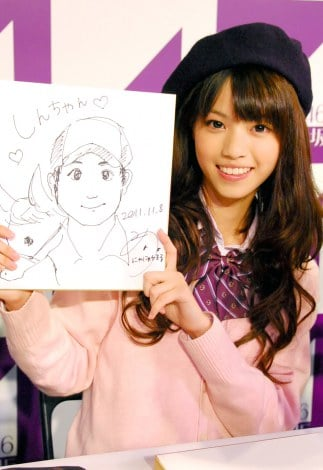
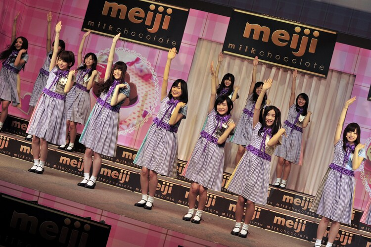

# Nogizaka46 Chronology

## Introduction

The chronology of Nogizaka46 is currently incomplete, with numerous events yet to be documented. The process of updating this record is ongoing and will be carried out sequentially as a never-ending longpost. It's important to note that the chronology includes both planned and actual events, which have been combined at least for the moment (I intend to signalize them in the future). Please be patient as I continue to refine and update this database.[^1]

## Pre-Debut

_The history of Nogizaka46 began with the birth of its members. Below is a chronological list of the members' birth dates and blood types._[^2]

### 1988 (Showa 63)
- **04/19** - Kojima Haruna: A member of AKB48, born in Urawa City, Saitama. Blood type: O

### 1990 (Heisei 02)
- **06/12** - Iwase Yumiko: First-generation member, born in Saitama. She was the oldest member at the time of the group's formation. Blood type: A

### 1991 (Heisei 03)
- **03/29** - Fukagawa Mai: First-generation member, born in Iwata City, Shizuoka. Blood type: O
- **07/27** - Matsui Rena: Member of SKE48, born in Toyohashi City, Aichi. Blood type: O

### 1992 (Heisei 04)
- **01/22** - Shinuchi Mai: Second-generation member, born in Saitama. Blood type: B
- **08/20** - Shiraishi Mai: First-generation member, born in Gunma. Blood type: A
- **08/27** - Matsumura Sayuri: First-generation member, born in Osaka. Blood type: B
- **11/21** - Sashihara Rino: Member of HKT48, born in Oita City, Oita. Blood type: O

### 1993 (Heisei 05)
- **01/04** - Eto Misa: First-generation member, born in Oita City, Oita. Blood type: AB
- **02/20** - Hashimoto Nanami: First-generation member, born in Asahikawa City, Hokkaido. Blood type: B
- **05/21** - Ando Mikumo: First-generation member, born in the Shonan area of Kanagawa. Blood type: O
- **05/26** - Ito Karin: Second-generation member, born in Yokohama City, Kanagawa. Blood type: O
- **07/03** - Nishikawa Nanami: Second-generation member, born in Tokyo. Blood type: A
- **07/20** - Saito Yuri: First-generation member, born in Tokyo. Blood type: O
- **08/20** - Akimoto Manatsu: First-generation member, born in Saitama. She was born in Tokyo and moved to Saitama when she was 7 months old. Blood type: B
- **10/29** - Miyazawa Seira: First-generation member, born in Chiba. Blood type: O

### 1994 (Heisei 06)
- **02/08** - Takayama Kazumi: First-generation member, born in Minamiboso City, Chiba. Blood type: A
- **03/26** - Watanabe Mayu: Member of AKB48, born in Saitama. Blood type: AB
- **05/16** - Sakurai Reika: First-generation member, born in Kanagawa. Blood type: A
- **05/19** - Nagashima Seira: First-generation member, born in Hekinan City, Aichi. Blood type: O
- **05/25** - Nishino Nanase: First-generation member, born in Osaka. Blood type: O
- **06/27** - Wakatsuki Yumi: First-generation member, born in Fuji City, Shizuoka. Blood type: O
- **08/06** - Nakada Kana: First-generation member, born in Saitama. She was born in Osaka and moved to Saitama when she was 0 years old. Blood type: A
- **08/12** - Kashiwa Yukina: First-generation member, born in Kanagawa. Blood type: B
- **10/18** - Noujo Ami: First-generation member, born in the Shonan area of Kanagawa. Blood type: A
- **12/14** - Inoue Sayuri: First-generation member, born in Honjo City, Saitama. Blood type: B
- **12/14** - Yamato Rina: First-generation member, born in Miyagi. Blood type: O

### 1995 (Heisei 07)
- **03/18** - Yada Risako: Second-generation member, born in Saitama. Blood type: A
- **07/23** - Kawamura Mahiro: First-generation member, born in Osaka. Blood type: A
- **09/06** - Yoshida Christie Ayano: Third-generation member, born in Oita. Blood type: A
- **12/05** - Hatanaka Seira: First-generation member, born in Oita. Blood type: B
- **12/12** - Ito Nene: First-generation member, born in Gifu. Blood type: B
- **12/29** - Ikoma Rina: First-generation member, born in Yurihonjo City, Akita. Blood type: AB

### 1996 (Heisei 08)
- **01/22** - Ichiki Rena: First-generation member, born in Chiba. Blood type: A
- **02/20** - Ito Marika: First-generation member, born in Kanagawa. She was born in Osaka and later moved to Kanagawa. Birthplace: Osaka, Hometown: Kanagawa. Blood type: O
- **04/13** - Nakamoto Himeka: First-generation member, born in Hiroshima. Blood type: O
- **07/17** - Kitano Hinako: Second-generation member, born in Chiba. She was born in Hokkaido and is from Chiba. Blood type: O
- **08/18** - Yoshimoto Ayaka: First-generation member, born in Kumamoto. Blood type: A
- **10/15** - Hori Miona: Second-generation member, born in Gifu. Blood type: O

### 1997 (Heisei 09)
- **01/22** - Ikuta Erika: First-generation member, born in Tokyo. She was born in Dusseldorf, Germany, and grew up in Tokyo from the age of 5. Born in Germany, Hometown: Tokyo. Blood type: A
- **02/17** - Saito Chiharu: First-generation member, born in Saitama. Blood type: A
- **05/21** - Yamazaki Renka: Second-generation member, born in Tokyo. Blood type: B
- **11/26** - Sagara Iori: Second-generation member, born in Saitama. Blood type: O

### 1998 (Heisei 10)
- **01/31** - Higuchi Hina: First-generation member, born in Tokyo. Blood type: A
- **02/06** - Hoshino Minami: First-generation member, born in Chiba. Blood type: B
- **03/22** - Kawago Hina: First-generation member, born in Nagasaki. Blood type: O
- **03/23** - Sato Kaede: Third-generation member, born in Aichi. Blood type: A
- **03/31** - Yamamoto Honoka: First-generation member, born in Aichi. Blood type: O
- **04/23** - Wada Maaya: First-generation member, born in Hiroshima. Blood type: O
- **08/10** - Saito Asuka: First-generation member, born in Tokyo. She was the youngest member at the time of the group's formation. Blood type: O
- **08/28** - Sasaki Kotoko: Second-generation member, born in Saitama. Blood type: A
- **09/23** - Terada Ranze: Second-generation member, born in Tokyo. Blood type: Unknown
- **11/30** - Ito Junna: Second-generation member, born in Yokohama City, Kanagawa. Blood type: A

### 1999 (Heisei 11)
- **01/06** - Umezawa Minami: Third-generation member, born in Kanagawa. Blood type: A
- **01/12** - Tamura Mayu: Fourth-generation member, born in Saitama. Blood type: A
- **10/02** - Yumiki Nao: Fourth-generation member, born in Kyoto. She was part of Sakamichi Kenshusei. Blood type: A
- **03/05** - Suzuki Ayane: Second-generation member, born in Ogata Village, Akita. Blood type: O
- **04/14** - Yonetoku Kyoka: Second-generation member, born in Kanagawa. Blood type: AB
- **07/26** - Yamashita Mizuki: Third-generation member, born in Tokyo. Blood type: O
- **08/23** - Mukai Hazuki: Third-generation member, born in Tokyo. Blood type: A
- **09/13** - Ozono Momoko: Third-generation member, born in Kagoshima. Blood type: O
- **11/01** - Watanabe Miria: Second-generation member, born in Tokyo. She became the youngest member of the group after joining the second generation. Blood type: O

### 2000 (Heisei 12)
- **05/05** - Yoda Yuki: Third-generation member, born in Fukuoka. Blood type: O
- **08/24** - Hayakawa Seira: Fourth-generation member, born in Osaka. Blood type: A

### 2001 (Heisei 13)
- **07/14** - Kubo Shiori: Third-generation member, born in Miyagi. Blood type: O
- **08/08** - Kaki Haruka: Fourth-generation member, born. Blood type: A
- **08/08** - Kitagawa Yuri: Fourth-generation member, born in Kanagawa. Blood type: Unknown
- **08/09** - Sato Rika: Fourth-generation member, born in Iwate. She was part of Sakamichi Kenshusei. Blood type: B
- **09/27** - Nakamura Reno: Third-generation member, born in Tokyo. Blood type: Unknown
- **10/03** - Endo Sakura: Fourth-generation member, born in Aichi. Blood type: Unknown
- **10/31** - Kanagawa Saya: Fourth-generation member, born in Hokkaido. Blood type: O
- **11/10** - Sakaguchi Tamami: Third-generation member, born in Tokyo. Blood type: A

### 2002 (Heisei 14)
- **08/14** - Yakubo Mio: Fourth-generation member, born in Tokyo. Blood type: B
- **05/12** - Ikeda Teresa: Fifth-generation member, born in Tokyo. Blood type: TBD
- **10/08** - Ito Riria: Third-generation member, born in Okinawa. Blood type: B
- **11/20** - Kakehashi Sayaka: Fourth-generation member, born in Okayama. Blood type: B

### 2003 (Heisei 15)
- **03/03** - Shibata Yuna: Fourth-generation member, born in Chiba. Blood type: A
- **03/17** - Nakanishi Arno: Fifth-generation member, born in Chiba. Blood type: A
- **04/17** - Kawasaki Sakura: Fifth-generation member, born in Kanagawa. Blood type: TBD
- **05/24** - Ichinose Miku: Fifth-generation member, born in Fukuoka. Blood type: B
- **08/01** - Seimiya Rei: Fourth-generation member, born in Saitama. Blood type: O
- **10/02** - Hayashi Runa: Fourth-generation member, born in Kanagawa. She was part of Sakamichi Kenshusei. Blood type: O
- **12/17** - Okamoto Hina: Fifth-generation member, born in Aichi. Blood type: A

### 2004 (Heisei 16)
- **10/02** - Matsui Miyu: Fourth-generation member, born in Chiba. She was part of Sakamichi Kenshusei. Blood type: O
- **01/19** - Kuromi Haruka: Fourth-generation member, born in Hong Kong. She was part of Sakamichi Kenshusei. Blood type: O
- **02/02** - Iwamoto Renka: Third-generation member, born in Tokyo. She became the youngest member of the group after joining the third generation. Blood type: B
- **06/08** - Tsutsui Ayame: Fourth-generation member, born in Aichi. She became the youngest member of the group after joining the fourth generation. Blood type: O

### 2005 (Heisei 17)
- **02/17** - Inoue Nagi: Fifth-generation member, born in Kanagawa. Blood type: B
- **07/29** - Ioki Mao: Fifth-generation member, born in Hyogo. Blood type: O
- **08/20** - Okuda Iroha: Fifth-generation member, born in Chiba. Blood type: A
- **10/31** - Sugawara Satsuki: Fifth-generation member, born in Chiba. Blood type: A

### 2006 (Heisei 18)
- **09/18** - Tomisato Nao: Fifth-generation member, born in Chiba. Blood type: O

### 2007 (Heisei 19)
- **06/27** - Ogawa Aya: Fifth-generation member, born in Chiba. She became the youngest member of the group after joining the fifth generation. Blood type: B

## 2011 (Heisei 23)
### June

- **06/29** - The recruitment for members of AKB48's official rival, "Nogizaka46", begins.
    - The recruitment for the first-generation member audition starts on June 27.
    - The group is announced as officially produced by Yasushi Akimoto.
    - Nogizaka46 opens its official website, and member recruitment is done through it. (TODO: Look up if this version of the website is archived anywhere)
    - Applications can be made through the official website's entry form or by mail. (TODO: Same as above)
    - (Eligibility) Women aged 12 to 24 as of April 1, 2011 (Friday), who can participate in the second interview examination (August 6, 7) and the final examination (August 20, 21), who can be exposed on TV, WEB and other media during the examination process, and who do not have an exclusive contract with a specific record maker, production, or music publisher.
    - (Application Method) Choose one of the methods: "WEB", "mail", or "present".
    - Only one entry per person is possible, and there is no need to enter in all methods.
    - There is no advantage or disadvantage in the selection depending on the application method.

### August
- **08/21** - The final audition is held, and 36 people pass. This is the "formation day of Nogizaka46".
    - The songs performed by the 36 people in the final audition are listed as:

| Idol            | Music                                                                     |
|-----------------|---------------------------------------------------------------------------|
| Akimoto Manatsu | [Nakanomori BAND "Oh My Darlin'"](https://youtu.be/v0qdK_aIilI)           |
| Ando Mikumo     | [Ayaka "Peace loving people"](https://youtu.be/wcqu7QxQ6SA)               |
| Ikuta Erika     | [aiko "Star"](https://youtu.be/zUR657LxP4k)                               |
| Ikoma Rina      | [Piko "Sakura Sound"](https://youtu.be/vFfPYPd16CU)                       |
| Ichiki Rena     | [Ai Otsuka "Planetarium"](https://youtu.be/txmw-wGnDoA)                   |
| Ito Nene        | [aiko "Boyfriend"](https://youtu.be/JzdWR_RfH3s)                          |
| Ito Marika      | [aiko "Beetle"](https://youtu.be/wp2U40KI63A)                             |
| Inoue Sayuri    | [AKB48 "Being Myself"](https://youtu.be/JOJBLeDO8cY)                      |
| Iwase Yumiko    | [Aya Ueto "For Love"](https://youtu.be/oFvE_m_644U)                       |
| Eto Misa        | [Every Little Thing "Like When We Met"](https://youtu.be/k1S0i8FoV4c)     |
| Kashiwa Yukina  | [Seiko Matsuda "Summer Door"](https://youtu.be/WojtxUZvuKA)               |
| Kawago Hina     | [Atsuko Maeda "Flower"](https://youtu.be/HwM3sqaLpfI)                     |
| Kawamura Mahiro | [Miho Fukuhara featuring AI "O2"](https://youtu.be/clrgylIk4Mk)           |
| Saito Asuka     | [Kana Nishino "if"](https://youtu.be/fQK9itJT4LA)                         |
| Saito Chiharu   | [Kaela Kimura "Butterfly"](https://youtu.be/h5b-tBZfsT8)                  |
| Saito Yuri      | [AKB48 "About You"](https://youtu.be/hOpuFBfc_UA)                         |
| Sakurai Reika   | [Happiness "Kiss Me"](https://youtu.be/4UAP--Ltb1E)                       |
| Shiraishi Mai   | [Kana Nishino "As It Is"](https://youtu.be/77DXiyjv1k8)                   |
| Takayama Kazumi | [Momoe Yamaguchi "Dream Guide"](https://youtu.be/rj3Jo8wchAQ)             |
| Nagashima Seira | [Ai Kawashima "My Love"](https://youtu.be/Ng5LgIfMfR4)                    |
| Nakada Kana     | [French Kiss "The Work of the Night Wind"](https://youtu.be/BkxOLER3pMI)  |
| Nakamoto Himeka | [AKB48 "I Wanted to Meet You"](https://youtu.be/fikzcy8s-f4)              |
| Nishino Nanase  | [Yui Aragaki "Red Thread"](https://youtu.be/o8OC7977uyw)                  |
| Nōjō Ami        | [Angela Aki "Letter"](https://youtu.be/8MB7H88GZ-w)                       |
| Hashimoto Nanami| [Undergraph "Wing"](https://youtu.be/7pAO3TsuTjo)                         |
| Hatanaka Seira  | [Ayumi Hamasaki "HEAVEN"](https://youtu.be/UZduO8YltB0)                   |
| Higuchi Hina    | [Mika Nakashima "ORION"](https://youtu.be/G_1VqiTYn8k)                    |
| Fukagawa Mai    | [aiko "Kiss Hug"](https://youtu.be/r8yTsDQCfR0)                           |
| Hoshino Minami  | [Warota "Flag of Youth"](https://youtu.be/3gRUfdbjKQs)                    |
| Matsumura Sayuri| [YUI "feel my soul"](https://youtu.be/h9WWfh_WZ6M)                        |
| Miyazawa Seira  | [Ayaka "Under the Same Sky"](https://youtu.be/Eq4hSV6Hvn0)                |
| Yamato Rina     | [Asami Hayashi "Tsuntsun Tsugaru"](https://youtu.be/iVdSeUXiydw)          |
| Yamamoto Honoka | [AZU "For You"](https://youtu.be/AD1-R7PxYx8)                             |
| Yoshimoto Ayaka | [Ayumi Hamasaki "Sunrise? LOVE is ALL?"](https://youtu.be/EbXH3nmrLW4)    |
| Wakatsuki Yumi  | [SONOMI "You're Not Alone"](https://youtu.be/hVjba1aw21M)                 |
| Wada Maaya      | [AKB48 "Ponytail and Shushu"](https://youtu.be/SwXtaahxjls)               |

- **08/22** - The 36 first-generation members are introduced, and the provisional selection consisting of 16 people is revealed.
- **Late August:** Instructions are given to the selected members by the staff.
    - "Those who live in the countryside, basically, will come to Tokyo by October 1st."
    - Nishino Nanase, who couldn't make up her mind, initially commutes from her parents' home in Osaka.
    - In the case of commuting, it will be a weekend-only visit to Tokyo.
    - Nagashima Seira from Aichi Prefecture is seen off by many best friends at the entrance of the Shinkansen when she moves to Tokyo.
    - Wakatsuki Yumi from Shizuoka Prefecture immediately decides on a high school in Tokyo, and goes to a high school in Tokyo on September 1st (Thursday) after the summer vacation.

### September
- **Early September:** The selected members from the countryside will live in a dormitory prepared by the staff.
    - Due to applications and other circumstances, they cannot enter the dormitory. They will live together in a hotel for a month.
    - The shared life is in a business hotel with two people in one room.
    - Hashimoto Nanami and Fukagawa Mai, Hatanaka Seira and Wakatsuki Yumi, Kawamura Mahiro and Nagashima Seira,
    - Kawago Hina and Nagashima Seira become roommates respectively.[^3]
    - The room has two beds, a small desk and chair, and a TV.
    - The daily flow of the countryside group is to wake up at 8 am, all members gather for breakfast at the hotel's breakfast buffet.
        - Student members go to school. Adult members without a school collect everyone's laundry and do laundry at a coin laundry, etc.
        - At night, after the lesson is over, they buy a bento at a convenience store and eat in the hotel room. Then they all go to bed.
    - Ikoma Rina, their future first center, becomes homesick and cries all the time.
      - There are no overnight stays other than school trips, and she has never eaten anything other than what her mother makes, and she has so many canker sores.
      - She cries so much that she gets a stuffed animal from the staff. She cries while hugging the stuffed animal.
      - Kawago Hina from Nagasaki Prefecture doesn't complain even though she is in the second year of junior high school.
- **Early September:** About two weeks after the final audition:
    - The successful members gather and the first lesson is held. The content is dance lessons and singing training.
    - Strict guidance is given from the first day of lessons. It's quite hard for the many inexperienced members.
- **09/22** - Yamamoto Ayaka resigns from her activities at her own request. **(L)**
- **09/22** - Yoshimoto Ayaka resigns from her activities at her own request. Yoshimoto was a candidate for the first center. **(HUGE L)**
- **09/22** - Akimoto Manatsu announces a hiatus from activities until next spring for academic dedication.
- **09/22** - It is revealed that Ririko Aso (real name is Nōjō Aimi) and Kawai Hina (real name is Kawago Hina) participated under a stage name against the recruitment guidelines. (TODO: Add this to an eventual list of all the official and unnofficial rules ever imposed in the group)
    - From now on, the two will be active under their real names.
- **09/25** - The first official "1st Generation Omitatekai" is held in the evening.
    - The venue is the Nogizaka Building of Sony Music Entertainment in Akasaka 9-chome, Minato-ku, Tokyo.
    - A handmade sign by the members is placed at the entrance of the building.
    - Large paper with "Thank you for coming" and "Please enjoy" written on it is posted on the wall of the corridor.
    - The first event where members appear in front of fans. 200 people who won the lottery gather.
    - A list with photos of all members and a questionnaire are distributed to the fans who entered the venue.
    - Sakurai Reika, the MC, appears on the pitch-black stage.
    - After explaining the flow of the event, 32 members appear.
    - Of the 36 successful candidates, Yamamoto Honoka and Yoshimoto Ayaka declined to participate, and Akimoto Manatsu is on hiatus to focus on her studies.
    - Members introduce themselves and show their special skills. Fans consider "who to oshi".
    - Sakurai Reika's self-introduction:
      - "I, actually, have been raised in a girls' school for about 14 years, from kindergarten, elementary, middle, and high school, so I have no immunity to the opposite sex."
      - "The only ones I've ever spoken to properly are my father and, the male members of Nogizaka46."
      - "Ah, there are no male members. Um, only male staff. It's amazing to be seen by so many people like this, I'm really nervous..."
    - Ikoma Rina's self-introduction:
      - "My favorite food is hot rice and 'Gakko'. Do you know what 'Gakko' is?"
      - "In Akita Prefecture, it refers to pickles. I may look cool in the photo, but..."
      - "I'm really sorry for those who were disappointed by the real thing."
    - Individual 3-minute PR goes on.
    - Fans select their favorite members. After the self-PR is over, the handshake event begins.
    - Participants choose one Oshimen on the spot from the 33, shake hands with the member, and receive a "Fan's Certificate".
  
  *Original Nogizaka Fan Certificate*
    - Two popular members who attracted a lot of attention compete. Mai Shiraishi and Kazumi Takayama. 
    - Some members only had one fan come to shake hands.
    - Nevertheless, all members shake hands of their fans with all their hearts.

### October
- **10/01** - Late at night, the broadcast of "Where is Nogizaka?" produced by TV Aichi on the TV Tokyo network begins.
    - [For details on all 180 episodes of "Where is Nogizaka?", please refer here] ==> **TO-DO**
- **10/01** - "Where is Nogizaka? (#001)" is broadcast.
    - Yasushi Akimoto, the general producer, comments on the concept of Nogizaka46.
        - "The concept is that there is no concept."
    - The management staff selects the first selection members from the 33 successful candidates based on the results of the lessons and the responses on the official website.
    - 15 people are chosen, including the "Temporary Kami-7 (☆)".
    - Shiraishi Mai, Ikuta Erika, Sakurai Reika, Takayama Kazumi, Ando Mikumo, Miyazawa Seira, Hoshino Minami, Wakatsuki Yumi, Saito Asuka, Ichiki Rena, Nakada Kana, Yamato Rina, Fukagawa Mai, Iwase Yumiko, Ikoma Rina.
- - Nogizaka46's first CM ["Meiji Handmade Chocolate"](https://youtu.be/6WobWrPAQ10) is decided.
    - 16 people including Rina Ikoma are selected as "Chocolate Selection".
    - The 16 people are Ikuta Erika, Ikoma Rina, Ichiki Reina, Inoue Sayuri, Kawamura Mahiro, Saito Asuka, Saito Yuri, Sakurai Reika, Shiraishi Mai, Takayama Kazumi, Nakada Kana, Nishino Nanase, Eto Misa, Hashimoto Nanami, Hoshino Minami, Matsumura Sayuri.
    - The "Chocolate Selection" is a separate member selection from the selection of the single main song "Guruguru Curtain".
- **10/08** - Eto Misa appears as the 9th assistant in the music program "Kaiun Music Hall" broadcasted on TBS TV.
    - Later: She will also serve as the 10th assistant. The first consecutive assistant.
    - The program is broadcast early in the morning from 4:30 to 5:00 on Saturdays. Kanto local.
- **10/09** - "Where is Nogizaka? (#002)" is aired
  - The 15 members selected in the last show challenge a variety show. A major announcement is made by the MC, Bananaman.
  - They decide to select a super selection of members for Nogizaka46, similar to the "Kami7" of their official rival, AKB48.
  - The "7 Lucky Gods" are decided on the 2nd broadcast. This decision comes about a month after the final audition (recording in late September?).
  - Each member's name is called one by one: Shiraishi Mai, Sakurai Reika, Nakada Kana, Ikuta Erika, Takayama Kazumi, and Ikoma Rina.
- **Mid-October** - 1st photo shoot of Eto Misa takes place on Ishigaki Island, Okinawa Prefecture
  - The photobook "Aaze" will be released on 01/31/2012 by Wani Books.
- **10/23** - Additional event for the "1st Generation Omitatekai" is held
  - The venue is Shinkiba STUDIO COAST, 2 Chome Shinkiba, Koto City, Tokyo.
  - This is an additional performance due to a large number of applicants for Nogizaka46's first event held on September 25th.
  - Fans who missed out on the first limited application for 200 people at the Nogizaka Building are invited first.
  - There are two parts, one starting at 13:00 and another at 18:00.
  - Over 1,000 fans gather for the idol group that has not yet debuted.
  - The event begins with self-introductions from 8 middle school members who can't participate until the end due to time constraints.
  - Ikuta Erika, the first performer, sings the song "Dreams Broken" from the musical "Les Miserables", leaving the audience in awe.
  - Then, each member continues to introduce themselves by utilizing their own special talents, pleasing the audience.
  - Next, 25 high school and older members introduce themselves. Each member appeals to fans with singing, dancing, talking, imitating, etc.
  - After all the members' self-introductions, it's time for fans to choose their favorite member.
  - Members move to a handshake booth near the exit. Seven-member groups wait in turn.
  - In this harsh situation where only one member is chosen for a handshake, some members start crying out of anxiety before the handshake event starts.
  - Members show happy tears when they see fans lining up for handshakes.
  - The last group consists of six members: Ikoma Rina, Ikuta Erika, Shiraishi Mai, Takayama Kazumi, and Matsumura Sayuri.
  - The lines for Ikoma, Ikuta, Inoue, and Matsumura stop. In contrast, the lines for Shiraishi and Takayama continue.
  - As a result, Shiraishi's line stops first.
  - "The talk was interesting. I was planning to go to other members, but I was caught."
  - "Thank you very much." Takayama's voice echoes in the handshake booth.
  - Tears shine in the eyes of Shiraishi in the booth next to her.
- **10/24** - The event is once again held at Zepp Tokyo from 19:00.
  - The total number of fans who attended the first meeting on September 25th, and the additional meetings on October 23rd and 24th is 3200.
  - Overall the most popular members for handshakes are: 1st / Shiraishi Mai, 2nd / Takayama Kazumi, 3rd / Inoue Sayuri, 4th / Ikoma Rina, 5th / Matsumura Sayuri.

### November
- **11/06** "Where is Nogizaka? (#006)" airs revealing the "Chinsuko Incident".
   - In the first dressing room meeting, Ikuta Erika ate two pieces and Eto Misa ate two pieces (possibly three) of chinsuko (a type of Okinawan cookie) which was brought as a souvenir by Eto Misa. 
   - Because of this, the cookies did not reach other members.
- **11/08** The second official event, "Limited to 100 people! We will draw your portrait! Meeting" is held
   - Held at SHIBUYA BOXX in Tokyo from 19:00. Participating members are Nanase Nishino, Rina Ikoma, Sayuri Matsumura, Renka Ichiki, Mayu Kawamura, and Yumiko Iwase.

*Nishino Nanase in the aforementioned event.*
   - Members who like drawing will sketch the participants' portraits in 2 minutes and present it on the spot.
- **11/10** "We will draw your portrait! Meeting" is held again.
   - Held at SHIBUYA BOXX in Tokyo from 19:00. Participating members are Mai Fukagawa, Nanami Hashimoto, Sayuri Inoue, Rina Yamato, Nei Ito, and Misa Eto.
- **11/11** The official blog by the members is launched.
   - Wakatsuki Yumi and Nakada Kana make their blog debut.
- **11/13** Saito Yuri, Hashimoto Nanami, Matsumura Sayuri, Nishino Nanase, Sakurai Reika, Inoue Sayuri, Nagashima Seira, Eto Misa, Kawamura Mahiro, Ikoma Rina, Ikuta Erika and Saito Asuka make their blog debut.
- **11/14** Fukagawa Mai, Shiraishi Mai, Ito Marika, Kawago Hina, Eto Misa, Takayama Kazumi, Hashimoto Minami, Higuchi Hina, Wada Maaya, and Nakamoto Himeka make their blog debut.
   - **11/15** Saito Chiharu makes her blog debut.
   - **10/08/2012** A year later Akimoto Manatsu makes her blog debut.
- **11/15 to 11/17** "Let us give you a personal message! Voice recording session" is held
- **11/23** - The first regional event "Nogizaka46 'Nice to Meet You' National Caravan" starts
   - **11/23** Osaka Prefecture Abeno Market Park Q's Mall
   - **11/26** Aichi Prefecture Port Messe Nagoya "Mammoth Flea Market Autumn 2011"
   - **12/03** Hokkaido Sapporo Station West Concourse Event Space
   - **12/10** Fukuoka Prefecture Tenjin Solaria Plaza 1F Event Space Zepha
- **11/24** - Nogizaka46 appears live for the first time on TV program "Good Morning Asahi"
   - "Good Morning Asahi" is a morning information program produced by Asahi Broadcasting (ABC TV)
- **11/27** - At night, "Where is Nogizaka? (#009)" conducts a dance skill check episode:
   - The "Dance Seven Lucky Gods" are selected: Ikuta Erika, Ikoma Rina, Inoue Sayuri, Kawamura Mahiro, Saito Asuka, Sakurai Reika, and Nakada Kana.
- **11/30** - "Nogizaka46 Convention 2011" is held at Zepp Tokyo in Tokyo. You can watch it [here](https://youtu.be/6h_f1eGnmIM).
   - Broadcast live on Nico Nico Live. This is the first live broadcast of a Nogizaka46 event, including TV and internet.
   - At the event, the members decide the content of their own performances and showcase their talents with elaborate singing and dancing.
   - The contents will be a focus of attention for future activities. The Nico Nico Live broadcast starts from 18:30 before the start of the event
   - The event starts at 19:00. Middle school members will participate until 21:00.

### December
- **Early December**
  - Purikura (photo booth) images of Wakatsuki Yumi taken before joining Nogizaka46 leak on the Internet, sparking a major online discussion.
    - Nogizaka46 Management Committee later releases a statement: "We do not question members' actions prior to joining unless they involve criminal activities. However, we apologize for the inconvenience caused to many fans and related parties."
    - Wakatsuki suspends her activities for the remainder of the year.
      - From December 8, her official blog goes silent.
      - On January 5, 2012, Wakatsuki resumes her activities. Her official blog updates the next day.
      - Despite being a candidate for captaincy, Wakatsuki is not chosen as a select member for the 2nd single.
- **12/11** - Nogizaka46 makes a guest appearance at the "42nd Tokyo Motor Show 2011". The members engage in gaming competitions and handshake events.
  - The venue is Tokyo Big Sight in Ariake, Koto Ward, Tokyo.
  - At 11:30 AM, ticket distribution begins. The event and handshake sessions start at 12:30 PM.
  - Handshake event ticket distribution starts at 2 PM, with the handshake event beginning at 3 PM.
  - 32 members, excluding Wakatsuki Yumi, participate.
- **12/12** - Wakatsuki Yumi suspends her activities due to a men-related issue. The official view is that past relationships are not a problem.

- **12/18** The late-night variety show "Where is Nogizaka?" (#012) is broadcast.
  - CD debut set for February 22, 2012 is announced.
  - Plans to hold "Nationwide Handshake Event" and "Individual Handshake Events" are also announced.

- **12/20 ~ 12/25**- "Nogizaka46 Christmas Special Week @ OPUS" is held at Sony Building in Ginza, Tokyo.
  - The venue is the 8th floor of Sony Building, located in Ginza 5-chome, Chuo-ku, Tokyo.
  - Throughout the period, members appear on different days to hold handshake events.
  - A director's cut version of the TV show Where is Nogizaka?" is projected on a 200-inch large screen.
  - Five Walkmans installed in the 1st floor entrance hall, each containing a Christmas message from the members. The members present on each day are as follows:
    - **12/20:** Ikoma Rina, Ichiki Rena, Iwase Yumiko, Saito Yuuri, Nōjō Ami
    - **12/21:** Shiraishi Mai, Nakada Kana, Nagashima Seira, Fukagawa Mai, Nishino Nanase, Ito Junna
    - **12/22:** Ito Marika, Eto Misa, Sakurai Reika, Hashimoto Nanami, Matsumura Sayuri, Kawamura Mahiro
    - **12/23:** Ikuta Erika, KawaGo Hina, Saito Asuka, Saito Chiharu, Nakamoto Himeka, Higuchi Hina, Hoshino Minami, Wada Maaya
    - **12/24:** Inoue Sayuri, Kashiwa Yukina, Takayama Kazumi, Hatanaka Seira, Miyazawa Seira, Ōyama Rina
    - **12/25:** Ichiki Rena, Ikoma Rina, Hoshino Minami, Sakurai Reika, Nakada Kana, Shiraishi Mai, Takayama Kazumi, Inoue Sayuri, Ōyama Rina, Ito Junna, Hatanaka Seira, Iwase Yumiko, Nishino Nanase, Nagashima Seira, Fukagawa Mai, Kashiwa Yukina, Miyazawa Seira, Ito Marika

- **Late December**
  - Recording of "Where is Nogizaka?" (#014) takes place.
    - Select members for the 1st single are announced. Wakatsuki Yumi waits in a separate room from the members.
    - Wakatsuki only listens to the audio from the studio. There's no video.
      - On January 8, 2012, "Where is Nogizaka?" (#014) is aired.

## 2012 (Heisei 24)

### January

- **Early January** - "Meiji Handmade Chocolate" CM Shooting Day
  - The waiting room is filled with chocolates and sweets prepared by Meiji Confectionery. The members are delighted with the abundance of sweets.
  - Members who were not selected for the "Meiji Selection" have to wait for the shooting of the selected members.
  - During the group shooting, each member of the selection is instructed by the staff on their standing position.
  - Ikoma is positioned in the center
- **01/05** - Nogizaka46 Prays for a Hit at Nogi Shrine
  - The members gather at Nogi Shrine to pray for the success of their debut single, which is scheduled to be released on February 22nd.
  - In a solemn atmosphere, Ikuta Erika, representing the members, performs the tamagushi ritual.
  - The members move from Nogi Shrine to SME Nogizaka Building.
  - An event called "New Year's Greeting! Meeting" is held with fans.
  - At the event, they make rice cakes and serve sweet red-bean soup to the fans, and all the members write their first calligraphy of the year to declare their determination.
  - At the end, Reika Sakurai tearfully declares, "I want to become a real professional idol and build a group that is worth supporting".
  - Yumi Wakatsuki, who had been refraining from activities, resumes her activities. Her official blog is updated on the 6th.
  - Wakatsuki, who was later said to be a candidate for captaincy, was not selected as a member of the 2nd single selection.
- **01/08** - The members of the debut single selection are announced on the late-night show "Where is Nogizaka?".
  - The Kami7: Ikuta Erika, Ikoma Rina, Shiraishi Mai, Takayama Kazumi, Hashimoto Nanami, Hoshino Minami, Matsumura Sayuri.
  - The nine selected members: Ichiki Rena, Inoue Sayuri, Kawamura Mahiro, Saito Asuka, Saito Yuri, Sakurai Reika, Nakada Kana, Nishino Nanase, Nojo Ami.
  - The two members of Banana Man, who serve as MCs, are in the studio. The 33 members are sitting in chairs in the waiting room.
  - The members have mobile phones in their hands. The selected members receive a call on their mobile phones.
  - The first phone to ring was Shiraishi's. The next person to pick up the phone was Matsumura.
  - Hashimoto also picked up her phone. Both Matsumura and Hashimoto were not selected among the 15 members at the start of the program.
  - After that, the mobile phones of Ikoma, Takayama, and Ikuta, who were the first seven lucky gods.
  - Six of the seven lucky gods are decided. The names of Ichiki, Nakada, and Sakurai, who were the first seven lucky gods, have not been called.
  - The last phone to ring was Minami Hoshino.
  - Next, the nine selected members are called: Kawamura, Inoue, Nishino, Nakada, Yuri Saito, Asuka Saito, Ichiki, Nōjō, Sakurai.
  - The selected members are about half of the 15 members selected.
  - The 16 people lined up in the studio and the 17 people watching them on the monitor in the waiting room.
  - For the first time, they are divided into "selected" and "non-selected (**under**)".
  - A message arrives from Yasushi Akimoto, the general producer, to the members who missed the selection:
  > To those of you who, unfortunately, were not selected. Don't be disappointed. This is just the beginning. It's not that you're not good because you weren't selected for the first selection. This time, we decided to go with these members because of the taste of the song, the tie-up situation, and so on. We've just started, so there's no such thing as who's superior and who's inferior. Find your own color and work hard to bring out a color that you think is indispensable to Nogizaka46. I'm looking forward to it.
- **01/12** - [The new TV commercial announcement event for Meiji's "Meiji Handmade Chocolate" is held, and the members who appear in the commercial attend.](https://www.youtube.com/watch?v=xivUmMG77kU&ab_channel=SankeiNews)
  - Sixteen members of the "Meiji Handmade Chocolate Selection" from all 33 members of Nogizaka46 appear in the commercial.
  - The members of Nogizaka46 depict a scene of "friend chocolate delivery" at school.
  - The debut song "Guruguru Curtain", which will be released on February 22nd (Wed), is used as the CM song.
  - Ahead of the CD release, the CM will be broadcast nationwide from January 14th (Sat).
  - At the announcement, the members' TV commercial is premiered for the first time. The members who participated in the shooting share their impressions in various ways.
  - The members talk happily about their first CM appearance in the talk corner and reveal episodes from the CM shooting.
  - The 16 selected members debut their song "Guruguru Curtain".
  - The selected members, dressed in purple checkered dresses, perform their debut song.

*Nogizaka46 performs their debut song "Guruguru Curtain."*

- **01/13** - The drama "Saba Doru" starring Mayu Watanabe of AKB48 starts on TV Tokyo.
  - The drama airs every Friday from 24:53 to 25:23, and it is Watanabe's first starring role in a serial drama.
  - The members of Nogizaka46 appear as Nogizaka46.
- **01/14** - "Guruguru Curtain" is used as the CM song for "Meiji Handmade Chocolate" and is broadcasted nationwide.
  - They depict a scene of "friend chocolate delivery" at school.
- **01/15** - Late at night, the coupling song of the 1st single "Aitakattakamoshirenai" is premiered for the first time on "Where is Nogizaka? (#015)". The lyrics are exactly the same as AKB48's major debut single "Aitakatta". The melody and arrangement are tweaked to a minor rock tone, resulting in an interesting finish with a darker image. As soon as the song is aired, a controversy arises on the internet.
- **01/19** - 
  - A full-page advertisement from Nogizaka46 is published on the 20th page of the Asahi Shimbun morning edition. The ad is only published in the Kanto region. The title is "Dear AKB48".
  - "AKB48 Request Hour Set List Best 100 2012" is held. The venue is Tokyo Dome City Hall in Koraku 1-chome, Bunkyo-ku, Tokyo. It is held for four consecutive days every January. The songs of the AKB48 group chosen by fan voting are announced in a ranking format.
- **01/26** - Three members appear on the live broadcast of "DJ Tomoaki's Radio Show!" on Shimokitazawa FM from 19:00.
- **01/27** - A special interview with Rena Ichiki is published in the March issue of the monthly "Dance View".
- **01/29** - At 4:00 in the morning, the selected members are called out. The 16 members are divided into four teams of four each for the PR of the debut CD.
- **01/30** 
  - The ringtone pre-distribution of "Guruguru Curtain" starts.
  - Three members appear on the live broadcast of BAY FM "K-WEST ENTAME GENERATION".
- **01/31**
  - The behind-the-scenes of "Guruguru Curtain" is published in the magazine "FLASH" published by Kobunsha.
  - Eto Misa's 1st photo book "Aaze" is released by Wani Books.

### February

## Footnotes

[^1]: This project is a translation and a continuation of the extensive work made by makuramoto-san, member of the Saitama-based Sakamichi Uncle Otaku Association in http://f-makuramoto.com/46-nogi/. His content is copyrighted, but I believe this would fall under fair use.

[^2]: Some non-Nogizaka46 idols were added as they are an important part of Idol Culture in itself.

[^3]: Information regarding Nagashima Seira's roommate seems duplicated and I can't identify the source to verify, is probably from a confused staff announcement or they might have changed roommates. We'll probably never be sure.