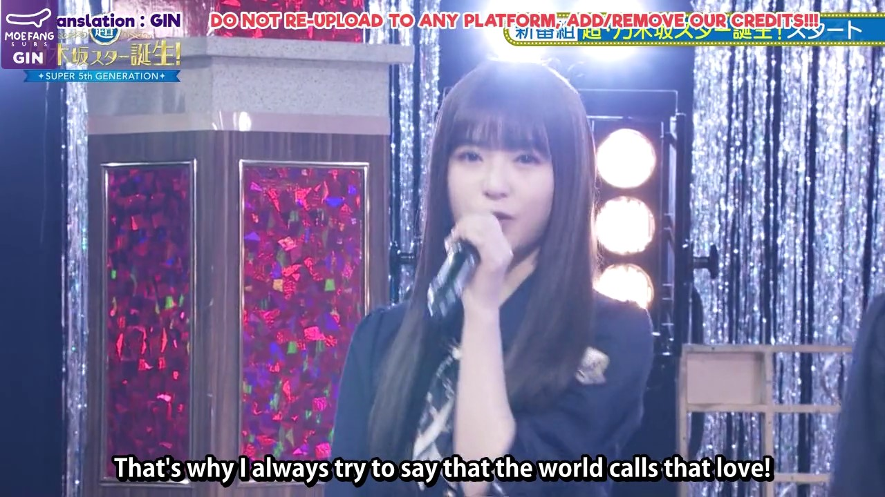

# Hardsubs: An Unethical Practice and Its Alternatives

## Understanding Hardsubs and Their Limitations

Hardcoding subtitles, or "hardsubs", is a process that overlays text onto video frames during encoding, resulting in a single, inseparable file. This practice, while suitable for streaming, introduces a significant risk factor: data fragility. If the video file is lost or corrupted, the subtitles are lost as well. 

A notable example of this fragility occurred in September 2021, when a Google Drive security update led to numerous broken file links. This event resulted in a significant amount of lost content, demonstrating the inherent vulnerability of hardsubs. Many links in the Nogizaka Masterlist[^1] and many other google related archives are now completely unnaccessible.

Hardsubs also present issues with accessibility and quality control. They cannot be resized, recolored, or repositioned to accommodate individual viewer needs, nor can they be read with text-to-speech applications. Once subtitles are embedded into a video, any errors in translation or timing become permanent, and the process of correcting these mistakes post-production is effectively impossible.

## The Ethical Implications of Hardsubs

The act of hardsubbing is inherently anti-otaku[^2]. It prevents the creation of procedural derivative works, which is a key aspect of otaku culture. For example, a fan might want to create their own fansub with a different translation or interpretation of the dialogue, or change it to another language entirely, but to do so they would require some sort of approval from the original subber. 

Notice too that some fansubbers and fansub groups copyright their created subtitles (img_1, img_2), despite the fact that the content they are subtitling is often copyrighted material that they do not own[^3]. This creates a paradox where they are breaking copyright laws while also enforcing their own copyrights, which can be only result of extreme stupidity or an openly spiteful intention.

*img_1: Imagine Subs showing how much they care about their immoral copyright claim, even if it means total loss of information, or how they call it: a mere inconvenience*

*img_2: GinSubs work is also another one that is completely*

## An Alternative

Softsubs, or non-hardcoded subtitles, present a solution to the issues posed by hardsubs. They allow for the information to be remodeled and redesigned as desired without risking the original content from being lost. They also provide viewers with the ability to adjust the subtitles to their individual needs.

## Extracting Subtitles from Hardcoded Videos

Subtitles can be extracted from any hardcoded video with two simple programs: VideoSubFinder and SubtitleEdit. VideoSubFinder is used to export the frames as very clean images containing only the subtitles, then SubtitleEdit's built-in OCR function is used to transform that into perfectly timed subtitles. After running it, all that's left is to curate the results, clean it, and then it can be published and shared.

## Conclusion

While there was a time when hardcoding subtitles was the best way to share information through pirate networks, the internet has evolved to handle more data. It's necessary for fansubbers to become aware of the risks they are imposing on their own work and in the culture in general. 

Moreover, the shift from hardsubs to softsubs presents an opportunity to preserve old media that is on the brink of being lost forever. By extracting and separately storing subtitles, we can ensure the longevity of these materials and protect them from potential data loss or corruption. This not only safeguards the work of fansubbers but also contributes to the preservation of otaku culture as a whole as it make possible for content that was originally lost to.

**This is a Work In Progress**

**This is a work in progress**

**TO-DO:**

1. Write defense on the argument of "bad subs is better than no subs";
2. Clarify that, as ASR systems develop, there will be no more scarcity;
3. Show more actual examples, like the fact that now that Nogizaka Skits blu-ray is out we cannot quickly work over it using Tamuhaya's translation as a basis;
4. Identify what exactly fansubbers gain from unethically copyrighting their work;
5. Show the many other instances of unethical behavior from some fansubbers: paywalled content for access, which takes this hypocrisy to another entire level. Ad-filled and highly vulnerable websites with 0 care for the user's safety and so on.
6. Present a list of ethical subbers within the Nogizaka46 community.

[^1]: Large parts of the community still organize and share content in giant collectively managed spreadsheets, where fansub groups go to share and store links to specific episodes and events.
[^2]: Doujin can best be defined as independent derivative work made by the members of a specific fanbase. In this context, hardsubbing is seen as anti-otaku because it prevents the creation of procedural derivative works.
[^3]: Some fansubbers and fansubgroups copyright their created subtitles, despite the fact that the content they are subtitling is often copyrighted material that they do not own. This creates a paradox where they are breaking copyright laws while also enforcing their own copyrights.
