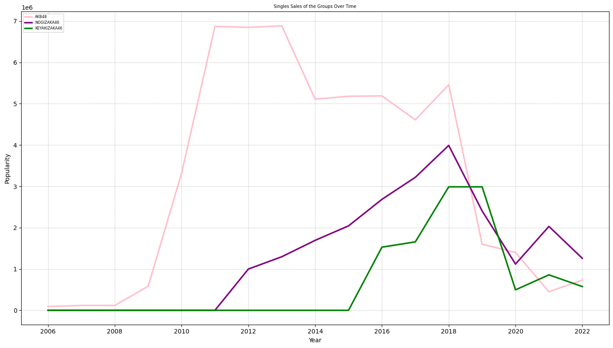

# Optimizing Brand Loyalty and Brand Identity among Idol Otaku

**Goal:** Find correlations between brand loyalty in the context of a consumer-driven subculture such as j-idol culture. Leveraging an analytical approach can help us understand the dynamics that cause certain groups to rise or fall in popularity. By doing so, we can propose an optimal strategy to maintain relevance within the attention market and navigate trends adeptly, while also identifying aggressive techniques for mantaining control of your current status. In this study, the performance of two historically relevant groups will be compared: Nogizaka46 and AKB48.

## Introduction

Introduction
In mid-2023, the J-pop group BokuAo was unveiled by Aki-P[^1] as the official rival of Nogizaka46. Initially, I believed that BokuAo wouldn't surpass Nogizaka46. However, a realization dawned upon me: when you are at the top, you can only go down. This prompted me to closely observe every decision made for the group since the end of what we can term the Golden Age of Nogizaka.

Drawing parallels to 2011, during AKB48's zenith, Akimoto Yasushi announced Nogizaka46 as a rival group. Their primary objective was to outperform AKB (and they succeeded). Yet, they weren't adversaries. Nogizaka often collaborated with AKB, be it through TV appearances or musical ventures. This symbiotic relationship saw Nogizaka's dependence on AKB, even as AKB grappled with its own decline.

From a strategic standpoint, if the intention was to elevate a group to the top spot, even at the cost of dethroning your own group, then promoting Nogizaka alongside AKB makes sense. But if the goal was to retain AKB's supremacy, these decisions appear counterintuitive, if not illogical.

## Starting Hypotheses

### The Attention Economy and Brand Identity

Attention is a limited resource, so even the remote recognition of relevancy or quality in another group should be understood as diluting part of the attention you have hold of as a courtesy. This issue is even more attenuated when the group you are supporting has a large amount of members, therefore being able to reach a broader amount of your own community, to Nogizaka only 46 members (two less than AKB48's maximum) was enough to migrate a robust amount of attention to itself. Though, this is not always a problem. See sister groups. In special we can talk about Nogizaka's first Sister Group, Keyakizaka46. Keyaki was designed to occupy the attention that Nogizaka46 couldn't reach. While Nogizaka was refined and ellegant, Keyakizaka was a derivative group composed of rebelious teenagers, a fairly distinct concept from Nogizaka, therefore they were able to introduce more people to the collection they belonged to, also known as Sakamichi Series. 

Nogizaka46 and Keyakizaka46 had good synergy and even if there was an overlap, Keyakizaka was naturally attracting fans diferente parts of the community, which was fairly damageless to the communities. From now on we'll call those brief descriptions of the fundamental characteristics of a group as their "brand identity". My main hypothese is that this brand identity is what mainly drives the brand's attractiveness of new attention (people) to the group, while also being the one responsible for keeping fans in the community as time passes. A good balance between those two would be the most adequate way of promoting a group and mantaining a good volume of fans, as achieving a long-term success for any brand relies on both **building** and sustaining strong **brand loyalty**.

## Data

Here I will be sharing and consolidating my exploratory analysis as I move on with the project. Ideally this will be reorganized in the future as a proper, clean and concise post, but for now read at your own risks and take the next insights with a bit of skepticism.

In most of those analysis we'll be comparing AKB48, Nogizaka46 and Keyakizaka46/Sakurazaka46 (We'll treat this one as a single thing) to identify the impact of adjascent groups and also noticing how much they differ based on a similar or different brand identity.

### Yearly Growth Rate:

Using anual sales performance, we can attempt to calculate the yearly growth rate of each group and see if the impact of it was felt by the other groups or not. This is a good start to pinpoint moments of great change in the group's performance, so we can do a data-driven analysis.

Here is the final table:

| Year | AKB48_growth_rate | NOGIZAKA46_growth_rate | KEYAKIZAKA46_growth_rate |
|------|-------------------|------------------------|--------------------------|
| 2006 | 0.000%            | 0.000%                 | 0.000%                   |
| 2007 | 27.171%           | 0.000%                 | 0.000%                   |
| 2008 | -0.179%           | 0.000%                 | 0.000%                   |
| 2009 | 396.806%          | 0.000%                 | 0.000%                   |
| 2010 | 468.748%          | 0.000%                 | 0.000%                   |
| 2011 | 107.263%          | 0.000%                 | 0.000%                   |
| 2012 | -0.331%           | ∞                      | 0.000%                   |
| 2013 | 0.534%            | 29.805%                | 0.000%                   |
| 2014 | -25.773%          | 30.670%                | 0.000%                   |
| 2015 | 1.363%            | 20.701%                | 0.000%                   |
| 2016 | 0.171%            | 31.381%                | ∞                        |
| 2017 | -11.164%          | 19.870%                | 8.347%                   |
| 2018 | 18.443%           | 23.990%                | 80.461%                  |
| 2019 | -70.696%          | -39.747%               | 0.000%                   |
| 2020 | -12.500%          | -53.441%               | -83.420%                 |
| 2021 | -67.885%          | 81.303%                | 73.204%                  |
| 2022 | 63.061%           | -38.004%               | -32.990%                 |

A few insights that we can infer from these results are the following:

#### AKB48

2006-2009: AKB48 started with a steady growth, with a massive spike in 2009, showing a growth rate of almost 397%.
2010-2011: The group's popularity exploded in 2010 with a growth rate of 468.75%. This momentum continued into 2011 with a growth rate of 107.26%.
2012-2013: AKB48's growth began to stabilize in 2012, with a slight decline, but picked up again in 2013 with a 0.53% growth.
2014-2016: The group faced a decline in 2014, but managed to recover slightly in the subsequent years.
2017-2021: AKB48 saw a significant drop in popularity in 2019 and 2020, with a decline of 70.70% and 12.50% respectively. 2021 saw a further decline of 67.89%.
2022: There was a resurgence in 2022 with a growth rate of 63.06%.

#### Nogizaka46

2013-2018: Nogizaka46 experienced consistent growth, with the highest being 31.38% in 2016.
2019-2020: The group faced a decline in 2019 and 2020, with rates of -39.75% and -53.44% respectively.
2021: Nogizaka46 saw a significant resurgence in 2021 with a growth rate of 81.30%.
2022: The group experienced a decline again in 2022 with a rate of -38.00%.

#### Keyakizaka46/Sakurazaka46

2017-2018: The group experienced consistent growth, with a significant spike in 2018 of 80.46%.
2019: There was no growth in 2019, indicating a stagnation in popularity.
2020: Keyakizaka46 faced a massive decline in 2020 with a rate of -83.42%.
2021: The group saw a resurgence in 2021 with a growth rate of 73.20%.
2022: The group experienced a decline again in 2022 with a rate of -32.99%.

### Comparative Analysis

#### Peak Growth years

AKB48: 2010 with a growth rate of 468.748%.
Nogizaka46: Ignoring their f2016 with a growth rate of 31.381%.
Keyakizaka46: 2018 with a growth rate of 80.461%.

AKB48's peak growth year was much earlier than the other two groups, and it also had a much higher growth rate. This indicates the period of Golden Age for idol otaku culture itself, and also portrays how **massive** AKB48 was at the time, making even more impressive how deep was the fall.

#### Years of decline

AKB48: 2012, 2014, 2017, 2019, 2020, and 2021.
Nogizaka46: 2019, 2020, and 2022.
Keyakizaka46: 2019, 2020, and 2022.

It's interesting to notice that all three groups faced declines in 2019 and 2020. This indicates the world-wide challenge caused by the pandemic and the lockdowns. AKB48 faced more years of decline compared to the other two groups, as it had been declining in sales performance since before the pandemic.

#### Recovery Years

AKB48: 2022 with a growth rate of 63.061%.
Nogizaka46: 2021 with a growth rate of 81.303%.
Keyakizaka46: 2021 with a growth rate of 73.204%.

After facing the challenges of the Covid-19 pandemic, all three groups showed signs of recovery. Nogizaka46 had the highest recovery growth rate in 2021, while AKB48's recovery in 2022 was also noticeable.

#### Consistency in Growth:

AKB48: Had significant fluctuations, with explosive growth in the early years, followed by periods of decline and recovery.
Nogizaka46: Displayed a more consistent growth pattern since its debut, with fewer years of decline.
Keyakizaka46: After its debut, the group had a rapid rise but faced challenges in recent years such as the Tecchi scandal and the eventual rebranding to Sakurazaka46.

Nogizaka46 appears to have the most consistent growth pattern, while AKB48 has faced more fluctuations.

#### Key Takeaways

AKB48 had a meteoric rise in the early years, but faced significant challenges in maintaining their popularity in the later years.
Nogizaka46 had a consistent growth after their debut but faced challenges in 2019 and 2020. However, they managed to bounce back in 2021.
Keyakizaka46 had a strong start after their debut but faced a significant decline in 2020. They managed to recover in 2021 with their return as Sakurazaka46, but faced another decline in 2022.

#### Overall Growth from 2006 to 2022

AKB48: Started at 92.427 in 2006 and reached 733,135 in 2022. A growth of approximately 745% in 16 years.
Nogizaka46: Started at 998.357 in 2012 and reached 1,258,450 in 2022. A growth of approximately 126% in 10 years.
Keyakizaka46: Started at 1.528.571 in 2016 and reached 575,120 in 2022. A growth of approximately -38% in 6 years.

AKB48, being the oldest group, has seen the most significant overall growth. However, considering the time frame, Nogizaka46 has achieved impressive growth in a shorter period.

#### Saturation Point

Other than Keyakizaka46, whose fall was caused by a very specific event, for both AKB48 and Nogizaka46 there seems to be a moment of saturation where growth slows down or even reverses. For AKB48 this seems to be post-2011, which is aligned with the announcement and begginning of promotions for Nogizaka46. For Nogizaka growth seems to have started to slow down after 2018, possibly due to the sequence of graduations of important members of the group. This could also be the cause for AKB's fall, but the possibility of cannibalization of AKB's fanbase by Nogizaka46 cannot be ignored.

#### Post COVID-19 Recovery

The rate at which groups recovered after the COVID decline indicates the strength of their brand and loyalty of their fan base. Nogizaka46's impressive recovery in 2021 showcases a strong brand equity.

#### Risk and Consistency

From a business perspective, Nogizaka46 has shown much more consistent growth, which indicates stability and attractiveness for wota in the long-term. 

### Single Reception

Using digital metrics, we can analyze:

- Group's most well and poorly received singles per genre
- Group's most well and poorly received singles per producer
- Group's most well and poorly received singles per genre (based on lyrics)
- Group's most well and poorly received singles per songwriter (based on lyrics)
- Percentage of yearly singles under the median of acceptance
- Single's performance in specific seasons (do summer songs mog more than winter songs for AKB and less for Nogi, or vice versa.)
- Is the groups identity related to an specific music genre or is the preference something shared by wota accross all groups.

### Music Video Reception

Same but for MVs

### Number of Non J-pop Collaborations Per Year

like asuka and mondo grosso. specifically non-otaku focused collaborations.
member appearances on movies per year

### Concert Performances

### Global Reach Attempts and Impact

## Why the Wota matters more than the Idols

## Footnotes

[^1]: Aki-P, or Akimoto Yasushi is the founder of AKB48 and of it's own official rival, Nogizaka46. In 2023 he announced Nogizaka46's official rival group, the J-pop group Boku ga Mitakatta Aozora. He also produced Checkicco and Onyanko Club.

## Bibliography

