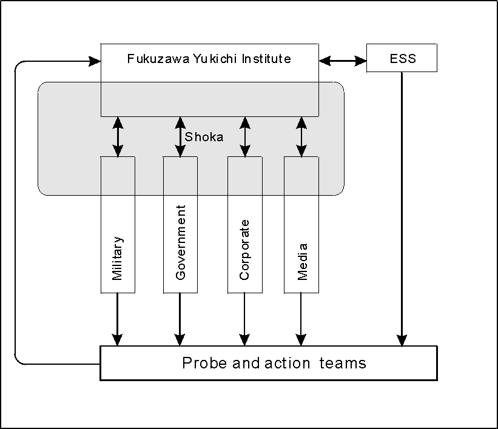

# KUROTOKAGE - Sourcebook

# Introduction

This is an attempt at archiving, contributing and eventually finishing the unfinished Kurotokage project. A Delta Green scenario set in Japan.

## Overview to keep track of what's going on

### Amaterasu

Sometime between 1000 and 2000 BC, a woman named Ashi (reed) became a shamaness for a tribe of native Japanese living in the Miyazaki, Kyushu region (called Hyuga). She was a skilled Dreamer, and used her skill to help propel her tribe to dominance of the extended region, eliminating/absorbing various other tribes.

While facing a Mythos threat to her people, or perhaps Japan as a whole, she went to a secret underground palace under Mt. Fuji, which was also (maybe?) a gateway to DL. She captured a piece of Azathoth in a "bottle" successfully. She did it because her normal Dreaming power couldn't handle the situation, so she turned to the very forces she hated. She won, but she was changed by the summoning and POW-boost from the Azathoth fragment. This is what allowed her to Dream the RW, for a limited time, defeating a Mythos god, maybe. But when she died, she ended up in the DLs, and was drawn to more Mythos contact, resulting in her insanity, and her desire (obsession) to turn the RW into Dreamlands.

The POW leakage from bottled Azathoth attracted Byakhee to around Mt. Fuji; they became established in Japanese folklore as tengu, and many of them indeed took on various human traits due to massive infusions of human genetic material over the centuries. By present-day times, essentially all of them are gone, because there is no more POW left from the Azathoth bottle.

She died, but continued to survive in DL. She later discovered that she was capable of exchanging information with, controlling and sometimes taking over the bodies of her descendents. She tried this a number of times, always expanding her kingdom's region and power, and in the process establishing her own origins as sacred, creating the Sun Goddess religion. Her descendents had demonstrated power, and were recognized as, in fact, a sacred bloodline.

As her power in both DL and the real world grew, she not only wanted more and more power, but also (1) started to go insane due to contact with the Mythos, and (2) discovered that, on rare occasions, she could control events in the real world from DL - in a sense, dreaming reality. This defined her long-term plan, which was to return to the real world as the Ultimate God, twisting reality there as she could Dream "reality" in the DL. Her tool would be the imperial bloodline, driven by the power of Azathoth.

Amaterasu's plan, which she has been carefully trying to guide to fruition for centuries, is to infuse the Real World with the essence of the Dreamlands. This would allow her to reenter the RW as a powerful god, and use it's new DLs "plasticity" to defeat Cthulhu and other Mythos powers, kicking them out of the Solar System and staking it out as her territory. She would thus be saving Earth from the Great Old Ones - except she'd be one of them herself, and humans (whatﾍs left of them after the God War) would be her servitors.

In order to pull this off, she needs a suitable candidate in the RW: one of her descendants, with a powerful Dreaming ability and incredible will. Due to the inbreeding over the centuries, and the way the people surrounding the Emperor have always done their best to stamp out any signs of willfulness in the young Imperial heirs (to make them easier to manipulate), such candidates are hard to find. She has tried and failed several times (witness WW2). At present, she seems not to be trying with the current Emperor or his eldest son. And this son is having no luck in producing an heir, male or female. But that is no guarantee of safety -- it might be that she needs a female vessel (which might be why the Imperial line long ago went from placing females on the throne to placing males there). And there is talk lately of putting a woman on the Chrysanthemum Throne if no male heirs are born.

Also, the process of infusing the RW with the essence of the DLs will almost certainly destroy the DLs, or at least change them profoundly (as described in [Davide Mana's "Dream Reaper"](../_wiki/Dream%20Reaper.md)). This could mean the deaths of millions and the destruction of the repository of humanity's collective unconscious.

### The Taira Emperor and the Emperor of Japan**

1. At the conclusion of the Gempei Wars (1185), the Emperor Antoku jumped from a ship at Shimonoseki, carrying the Sword (one of the three sacred imperial regalia) with him to his (presumed) death. The Minamoto took power, and Taira were hunted down and killed. In fact, Antoku did not die, and was the founder of the Emperor in Exile bloodline. That bloodline is still alive, in secret. (We refer to this guy as The Taira Emperor.) His goals are to (1) free the imperial family from Mythotic connections, (2) protect the common people, (3) become Emperor, in that order. The Taira Emperor, or The Taira, wields the real anti-Mythos power.

New: Two possibilities here, namely (1) Antoku (or his brain trust) formed an organization to keep an eye on the doings of the Emperor. At some later time (we need to figure out when and why), the group was taken over by the Emperor. (2) The group was created by the Emperor, and later penetrated by The Taira.

1. Go-Daigo was very unhappy with the pro-Mythos leanings of the emperor, and made an effort to wrest control back, with the idea of returning it to the Taira Emperor. He failed, and his line was relegated to poverty forever. That bloodline still exists, in public ([reference](../_wiki/Japan's%20Other%20Emperor.md)) Nobody bothers to kill him because he is so obviously unimportant. In Wakeworld he is in fact unaware of his identity as The Taira, and lives a normal life, in fact a bit embarrassed about his ancestors because of the publicity. All activities related to The Taira are handled in Dreamlands, often when The Taira is brought there by the Taininhodo. As a result, there are no communications in Wakeworld to be tapped by conventional police means available to the Kurotokage or Kuromaku.

### Organizations and drives

1. Taininhodo monks. In 1185, the Emperor was protected by these guys. These monks are not especially "for" the Invisible pretender and "against" the Mythos, but they are basically The Taira's bodyguards and hands. They are the only continuing support that The Taira has, since most operatives are recruited and wasted. The monastery serves as a kind of base, and the monks providing spiritual help (which can be as mundane as counseling and teaching meditation techniques to help recover lost SAN, or perhaps the monks actually know some magic).

Also, since most other operatives are in Kurotokage and therefore suspect (ie, tainted with the possibility that they belong to the Emperor), the single most important task of the Taininhodo is to protect The Taira. They isolate him from contact with outsiders by the simple but effective means of keeping all matters related to The Taira in Dreamlands, including the fully-aware consciousness of The Taira. They may require some method of being able to detect spies.

These guys are Buddhists. Their goals are for everybody to live in peace. As long as the Mythos nasties keep eating people, they will keep fighting the Mythos. They have no especial gripe against Mythotic creatures who DON'T eat people - this is a crucial difference. They also dislike people who hurt people, remember. They have, on occasion, fed ghouls dead bodies because they felt bad about "living" creatures (ghouls) suffering. If the IP moved to hurt lots of people, they would might well stop supporting him (ordering agents to certain death doesn't count!)

2. Kurotokage, the Emperor's anti-mythos organization. This organization, a semi-secret within the Japanese government, officially fights mythos creatures, drawing on people and resources from JSDF, National Police, etc, etc. It is directed by the Emperor, who is in fact using it to (1) waste potential Mythos opposition, (2) gain Mythotic information that could be of use, and (3) lay the groundwork for making himself a god. The organization itself, obviously, is not supposed to know about (2) and (3). Since this organization has the active backing of the Emperor, it has access to considerable resources. In addition, it enjoys strong ties with both corporate Japan and the yakuza.

Within Kurotokage there are three groups that matter. These are (1) the general gophers, who basically do everything that Kurotokage is supposed to be doing. (2) The Kuromaku, a high-echelon group which knows about his ultimate goals, and is actively working to assist him (these guys are REALLY nasty; see below), and (3) the poor good guys, usually people who have discovered that Kurotokage is bad, and are working to do something about it. This totally secret group is within the government, run by The Taira. They have essentially zero organizational resources other than what they personally can scrape up, or what the Invisible pretender provides (he has plenty of cash, since he had access to imperial funds over the centuries, one way or another...). The good guys have few resources, because while the Invisible pretender does have cash, it is very difficult to spend it on anything without being noticed (remember, the yakuza and corporate Japan belong to the Emperor's organization [However, those same organizations can be counter-controlled by The Taira, as Mark showed in his essay on the virtues of disorganization]). As a result, deniable operations where operatives are lost in action are common, and operatives accept the fact that they are expendable. The group needs all the help it can get, and non-Japanese operatives are not uncommon. It is more a group of people working toward a common goal (or perhaps, away from a common fear...) than an organization. They lack dg's ability to cover things up, because they are mostly individuals or very small groups, and not an organization. And they can never know whether the person next to them is working for the good guys or the bad guys.

The primary goal of the "Good guys" (3) is to prevent the Emperor from becoming a god, their secondary goal to protect the common people, and their least important goal to restore the Invisible pretender to the throne. They have few resources, face an enemy with the official strength of Japan at his fingertips (their fellow Kurotokage operatives and the rest of the government), and recognize that they are probably expendable.

The primary goal of the Kurotokage bad guys, on the other hand, is to protect the common people, but they are being used by the Emperor, and a few of them have realized the truth. This leads to conflict as they try to balance their loyalty for the Emperor with their genuine desire to protect people. They have extensive organizational resources to draw on, but a few of them realize they may be supporting the wrong people. If they are willing to try to do something about it, they become Good guys within Kurotokage.

### The Kuromaku

This "group" is responsible for carrying out Amaterasu's plan, although they usually have their own agendas instead of hers. They are also the ones who fill in a new Emperor on what's happening, in the event that Amaterasu doesn't (which is common; getting straight info from a crazy shamaness who died maybe 4000 years ago and is communicating through dreams, is not an easy task). As a result, individual members of the Kuromaku may know considerably more about what's going on than the Emperor himself.

The Kuromaku is the name generally used to describe the group of men (this is Japan; probably no women in this group [although women may play important, but unofficial roles, and Dave Farnell has promised us some info on the remains of the pre-Meiji concubine intel network]) who often decide the course of the Japanese nation. There is no formal organization, and the members rarely meet. The Kuromaku itself, as a group, has no resources, no people, no buildings, no funds. It is not an organization in any Western sense of the word, but rather a nickname used to refer to the way that the "makers and shakers" behind the scenes cooperate with each other to move Japan. The last full meeting took place on August 13, 1945, after the Hiroshima bombing. Members were called to the hospital room of Tamasaburo Imasaki, the real head of the Mitsuboshi group, who was dying of old age, and by the time they had arrived the second bomb had been dropped on Nagasaki. They had little to discuss; the Emperor was informed in no uncertain terms that Japan would surrender (Japan accepted unconditional surrender on August 14 1945).

Since it is not an organization in a true sense, it is difficult to determine precisely when the Kuromaku came into existence. Its origins definitely trace back to the earliest periods of recorded Japanese history, when the Emperor in power would "retire," turning apparent political power over to his son but in fact retaining all control. As the power of the warriors increased over the years, control of the nation gradually slipped from the hands of the Emperor, and the heads of military-political groups would meet with each other to discuss key issues, settling things quietly (when they could agree on a course of action - as often as not, the result was warfare).

As the merchant class emerged in the middle ages, the sheer power of money fueled the entry of several people into this select group, which, by this time, recognized itself as the actual power of Japan. As today, they almost never met, primarily because they knew they could never trust any of the other members, but also because they had little to talk about - almost by definition, members combined vast economic strength and a lust for power with an almost total lack of ethics. As a result, they could often accurately predict what other members would think of a situation, and act appropriately on major issues such as national policy. And when a problem flared between two members, they usually settled it themselves, and the other members wisely kept their noses out of the affair.

At the present there are seven (maybe) members, although new members can enter the group at any time by basically forcing the other members to accept them through sheer power (economic, military, political), successful blackmail of other group member or members (thus proving their fitness), or by achieving control of an existing member. It is also possible for existing members to be destroyed (for example, if the head of Hidachi, who would probably NOT be the president or chairman of the board, or even an officer, dies without arranging for a suitable replacement, Hidachi as a corporation continues business as usual, and is unaware that anything has happened. But the Hidachi group would no longer have any say in the Kuromaku, which would mean major advantages to Mitsue and Mitsuboshi.)

The current members are (in no particular order):

1. Head of Mitsuboshi zaibatsu Imura Koujin; 井邑晧人. For background info, see: [Information on Mitsubishi 1945 president]()
2. Head of Mitsue zaibatsu Utano Ikichi (歌野亥吉)
3. Head of Hidachi zaibatsu (possible conflict with Adam's ideas for Green Dragons).
4. Aozora-kai (Blue Sky Association), a group of strategic planners within MITI who have been working to achieve their own aims since the end of World War Two, including the Vice-Minister. Their aims are basically endless growth and development for "Japan Inc" as a nation, with little consideration for the individual Japanese citizen. No particular Mythos connections; sheer power grubbers.
5. Head of Black Ocean Society or Green Dragons (need input from Adam)
6. Head of the yakuza (possible conflict with Adam's ideas for Green Dragons)
7. Some group within the Imperial Palace, possibly the traditional heads of Shinto and related traditional rite and ritual, who would also be the guys grooming the new Emperor-to-be for his night out with Amaterasu. Another possibility is the Imperial Household Agency, Archives and Mausolea Department, Mausolea and Tombs Division (see: [Imperial Household Agency]() (in Japanese)). 

Of the kuromaku, the head of group 7 is always one of the shoka (see chapter on Amaterasu), and other kuromaku members have also been shoka in the past.

During the Edo Era (1603-1868), when the Tokugawa Shogunate ruled, the kuromaku consisted of:

1. Head of Black Ocean Society or Green Dragons (need input from Adam)
2. Head of the yakuza (possible conflict with Adam's ideas for Green Dragons)
3. Some group within the Imperial Palace, possibly the traditional heads of Shinto and related traditional rite and ritual, who would also be the guys grooming the new Emperor-to-be for his night out with Amaterasu.
4. The Shogun himself in the early years, but only until 1709 when the Shogun Tokugawa Tsuneyoshi died. From that time he was basically a tool of one group or another, usually the kuromaku.
5. Imagawa Shimbei, the head of the Silk Merchants' Guild, centered in the major trading cities of Sakai, Kyoto and Nagasaki. This was founded as a secret cartel of silk merchants during the 16th century, and in 1604 received a monopoly on the import and distribution of Chinese silk, which represented enormous wealth. Imagawa scrabbled his way to the top in 1596 and remained there until 1638; his son Imagawa Takataro took over both the Guild and the kuromaku membership at his death and remained in power until he died in 1673 and the kuromaku membership was lost. The Guild itself remained rich and powerful until early Meiji.
6. I'm sure there are others we need to add... any ideas? 

### Confused explanations of relationships between Amaterasu, Emperor, Kurotokage and Kuromaku  

Amaterasu sometimes controls the Emperor, sometimes another person in the Imperial bloodline. Sometimes she is missing, and the Emperor does what he wants.

When the Emperor has been filled in by Amaterasu on the situation (infected?), he works to make himself or his descendents a god. Kurotokage is a tool he uses to wipe out Mythotic competition, and collect info and power for his own use. He works with selected groups in the Kuromaku and Kurotokage to do nasty things, too.

He uses and is used by the Kuromaku, who have their own motivations. Some of the Kuromaku are Mythotic (Green Dragons, for example); others are merely after money. Most are neither anti- nor pro-Mythos, but may use it if it suits their needs (remember, the key factor for becoming a member of the Kuromaku is a lack of ethics).

The Emperor that the Green Dragons want is not the same Emperor that Amaterasu wants, because each of them wants to CONTROL the Emperor. And, not surprisingly, the Emperor often wants to control himself, too.

## General information on Japan

- Modern Japanese society in brief (LOST/NON-EXISTENT)
- Being a gaijin in modern Japan (LOST/NON-EXISTENT)
- Transportation in Japan (LOST/NON-EXISTENT)
- Prices in Japan (LOST/NON-EXISTENT)
- Law enforcement (LOST/NON-EXISTENT)
- The American military presence in Japan (LOST/NON-EXISTENT)
- Crime, yakuza, availability of guns etc in Japan (LOST/NON-EXISTENT)
- Brief outline of religion in Japan (Shinto, Buddhism, Christianity, Islam) (LOST/NON-EXISTENT)
- [Note on romanization of Japanese and name conventions](../library/Romanization.pdf) (PDF file)

## Japanese history and [timeline](../library/Kurotokage_Timeline.pdf) (real and Mythos)

- Early myths and legends (most history only covered in timeline)
### Meiji history

The modern emperors of Japan, from Meiji to Naruhito, have played pivotal roles in the country's history. This series explores their lives, beginning with Emperor Meiji (Mutsuhito).

**Emperor Meiji - Early Years (1852-1867):
**
- Born as Mutsuhito in 1852, Emperor Meiji ascended to the throne during the Meiji Era (1867-1911).
- At eight months old, Admiral Perry's arrival marked a significant moment in Japanese history.
- His father, Emperor Komei, was a relatively powerless figure, and the Imperial Family had been secluded and weakened for centuries.
- The Imperial Family faced challenges, including high infant mortality rates and political isolation.
- Raised by his grandfather, Lord Nakayama, Mutsuhito, later known as Prince Sachi, was a delicate child prone to tantrums.
- The concubines surrounding him, part of his intelligence force, controlled information and had connections across Japan and Asia.
- These concubines, forming an Amaterasu Cult, held secrets vital during the period when the Emperors were kept powerless by the Shoguns.

**Political Turmoil and Shogunate Decline (1867-1868):
**
- Emperor Komei strongly opposed opening up to the West, advocating for isolationist policies.
- The Tokugawa Shogunate signed unequal treaties with the West, leading to public unrest and the "Sonno Joi" movement, urging the expulsion of foreigners.
- The Choshu and Satsuma Clans, initially allied against foreign influence, faced internal conflicts due to differing goals.
- Choshu attacked the Imperial Palace in 1864, aiming to capture the Emperor, but was repelled, causing chaos in Kyoto.
- Emperor Komei supported the Shogunate against the conspirators, surprising them and leading to internal strife among the clans.
- The Emperor, powerless but a symbol of unity, played a role in shaping the events of this tumultuous period.

**End of Shogunate and Emperor Meiji's Rise (1868-1872):**

- Choshu and Satsuma secretly collaborated, leading to the downfall of the Shogunate.
- In 1868, Emperor Komei died, and Prince Mutsuhiro became Emperor Meiji.
- Despite being declared the restored Emperor, Meiji's power remained limited, as real political influence rested elsewhere.
- Internal power struggles and external threats marked this period, with the Green Dragons and Kuromaku potentially playing significant roles.

Emperor Meiji's early years set the stage for Japan's transformation, as the country navigated internal conflicts and external pressures. The next parts of this series will delve into the significant events and policies during the Meiji Era.

- Amaterasu's birth, death and plots
- The Imperial lines (real and IP/VP)
- The Imperial Regalia (Jewels, Mirror, Sword)

## Taininhodo

- The Tainin Hodo name
- Foundations of Tainin Hodo
- Sidebar: Kukai and Shingon Buddhism
- Ch'an (Zen)
- Philosophical Background
- Brief History of Tainin Hodo
- Ryuzoji Temple
- Taininhodo Today
- Taininhodo Magic

**The Taininhodo in the Dreamlands**

- The Dreamlands Temple
- Role of the Taininhodo in Dreamlands
- The Sacred Sword Kusanagi

**NPCs**

- Nyogen, the Abbot
- Tosui, Master of Taia
- Other characters 

## Kurotokage

**History**

### The Formative Years: 1524 to 1868

The Kurotokage trace their origins back to Nakahara Takatoshi, born in Kyoto in 1502. He spent his early years as a samurai in the service of the Lord of Tanba (near Kyoto), and in 1523 was dispatched for special training to an unknown and never-disclosed destination, thought to have been one of the ninja communities. He took the secret of his training with him to his grave (it is not included in the Nakahara Diary).

He did mention that his lord had expected him to continue to serve him for undercover missions after his training, but events intervened: in 1524 his training group encountered a byakhee, and the majority was killed. [When we actually write it up, we'll probably want to avoid specifically identifying it as a Byakhee, describing it instead to let the reader figure it out.] Nakahara himself was severely wounded, and was nursed back to health and sanity by a passing monk (name and sect unknown; probably Tainin Hodo). From that time, he devoted himself entirely to eradicating the byakhee (and related Mythos creatures) from Japan, gradually attracting a number of like souls to his side.

The first and foremost of these assistants was Momooka Shintaro, a wandering rowdy from Higo (present-day Saga, Kyushu). Momooka's experiences had been a bit different: he had been exiled from his homeland after various escapades involving gambling and less savory activities: he was given a choice of exile or death. In spite of his rather coarse nature and violent attitude, however, he genuinely cared for the peasants, and as he wandered Japan, deliberately evading all attempts to prevent free passage, he also helped the lower classes in many ways. One of these was his single-handed extermination of a community of *** (some kind of baddies) [Best would be to tie it in with something else, like the DO community, a nest of Ithaqua worshippers, etc, to provide foreshadowing.] on the island of Nashijima, in the Seto Inland Sea. He is thought to have been about ten years older than Nakahara.

By that time, Nakahara had a pass issued by the Ashikaga authorities, which was sufficient to allow him free passage almost anywhere in Japan. This was a delightful change for Momooka, of course.

Over the next two decades, the pair of them successfully cleansed many groups of "devil worshippers" from Japan, earning the private thanks of both the Emperor and the Ashikaga Shogunate. The Shogun, Ashikaga Yoshiharu, was especially appreciative, and after Nakahara lost an arm in battle and was forced to retire in 1543, offered him a position as the leader of a group of warriors trained to carry on his battle. This group had no official name, and was generally referred to as the "kasumi gundan," which could be translated as "mist corps," recognizing their somewhat hidden and transient existence. While mentioned in various historical records of the time in passing, it is generally thought to have been a bodyguard group.

With the death of Ashikaga Yoshiharu in 1546, the kasumi gundan moved even farther into the shadows as Nakahara's sons, recognizing the potential for conflict with the Shogunate itself, began accumulating and applying some of the various treasures gained from their adventures. The kasumi gundan became, in other words, a secret society which funded itself outside of government channels. Perhaps because of their need for a "good god" to stand against all the evil they fought, the Imperial family of Japan was worshipped, and there was often communication between the two groups. The Emperor, however, was extremely poor and powerless during much of this period, making it difficult for the Imperial family to have much effect on the activities of the kasumi gundan.

This transformation into a secret society had two immediate effects on the group. The first was that it became possible to disassociate itself from the Shogunate, thereby assuring the survival of the secret group even when the Ashikaga Shogunate fell, and again in future years as the government changed numerous times. The other effect was that the kasumi gundan began to adopt a philosophy that what they took by force was theirs, "for the good of Japan."

The kasumi gundan continued until the late 16th century as a combination of secret police and robbers. While most of their members were still actively anti-Mythos, a large number were merely armed ruffians, who often used the accusation of witchcraft as an excuse to rape and pillage. They continued to enjoy a channel of communication with the highest levels of government, however, always to the Emperor and usually to the Shogun or ranking officials, which made it possible for them to avoid scattered, regional efforts by police forces to capture or kill them. Since the entire nation was engaged in a succession of wars as power blocs vied to unify Japan and take the reins as Shogun, in fact they were rarely noticed.

This state of affairs changed abruptly in 1587, when Tokugawa Ieyasu boldly strode into a secret meeting of the highest echelons of the kasumi gundan and said he had come to talk. Appreciating his boldness, and perhaps the mention that the entire meeting place was surrounded by Ieyasu's trusted retainers, they talked for several hours. The agreement boiled down to the provision of intelligence and magical assistance, in return for official support and protection, along with plenty of cash. They agreed, in short, to actively support Ieyasu's bid for power, which finally ended in 1600 with him destroying all remaining opposition and unifying Japan under himself as Shogun.

This had established a new precedent, however... while the upper echelons of the kasumi gundan were aware of the relationship with the Shogun, no-one else was... including the majority of the personnel in the kasumi gundan itself. Under pressure from the Shogunate, the general robbers and cut-throats were gradually weeded out, while those with a genuine mission to protect Japan were supported. Ieyasu was making sincere efforts to ensure peace and stability in Japan, and part of that program included eliminating undesirable elements. He was, however, all in favor of having a group of men who would continue wiping out Mythos creatures and worshippers. A schism had been created between the upper echelons, which were aware of their relationship with the government, and the lower echelons, who knew only of their commitment to protect the people. And the upper echelons had agreed to provide Ieyasu with magical assistance as needed, which it was...

One of Ieyasu's sidekicks, ***, mentions in his diary that the Shogun once described the kasumi gundan as being "like little black lizards, scurrying to do my bidding." This is thought to be the first mention of the name "Kurotokage."

The ties with the Emperor remained active throughout this period, and the Amaterasu-Emperor noticed the potential usefulness of the kasumi gundan sometime around the mid-17th century [anytime from Ieyasu to Meiji, inclusive, actually...] when they acquired a set of the Seven Cryptical Books of Hsan. The Books had been recognized and held by the head of the kasumi gundan, and she promptly arranged to have them transferred to her control... in the process turning the leader of the kasumi gundan into a gibbering idiot. From this time, while Ieyasu tightened the screws on his control of Japan, the Emperor moved to gain complete control of the kasumi gundan, which was most easily achieved by controlling the top echelons, as they had already been turned by Ieyasu from their original "pure" motivations.

### New Challenges: 1868 to 1926

The Meiji Restoration is commonly viewed as a revolution that swept the Shogunate from power and reestablished the Emperor. However, it is more accurate to portray it as an internal reorganization of the Kuromaku, the shadowy cabal that truly rules Japan.

At the beginning of the Tokugawa Period, the newly established Shogunate did indeed have a great deal of control within the Kuromaku, and as such was easily able to establish itself as both the visible and invisible ruler of Japan. As time went on, however, other forces, some that had long been players within the Kuromaku, others new to the scene, were able to expand their power bases at the expense of the Shogunate, until after two and a half centuries the visible government was just a shell of its former self, ready to collapse with the right push. That push, the coming of Perry's Black Ships, was not an unforeseen, fortuitous event--the more successful members of the Kuromaku had kept their lines of communication to the outside world open, and knew very well what was going on.

Kurotokage had also suffered during the Tokugawa Period. While it had pledged its loyalty to the Shogun, it had remained secretly loyal to the Imperial Line, a dilemma that forced more than one suicide to avoid disobeying either master. Knowing that Kurotokage could not always be relied upon, the Shoguns choked off their funding more and more, making sure that the Emperors could get little use out of them, either. However, there were occasional missions that were so much in Kurotokage's line of expertise that they still saw some action, often in conjunction with the Shogun's secret police, who served both as support and as spies on Kurotokage. It was during this period that Kurotokage began to develop its system of contacts

throughout other intelligence services, like the secret police, so that it could learn about diabolic events even when the Shogun chose not to pass on the information. Thus, Kurotokage was able to carry out a number of missions that were secret from the Shogun, and even at times secret from the Emperor.

Or so it seemed to the rank-and-file agents of Kurotokage. In actuality, their highest commanders had long been aware of the Kuromaku, and were serving them, essentially pledging loyalty to whomever was in power at the time. For a long time, that was the Shogunate, but as time went on, it shifted among several key players, even though the Shogunate was the visible ruler. Kurotokage would then carry out missions to put down supernatural threats that could weaken their current master. To avoid letting the lower-level agents know that they weren't being steadfast and true servants of the Emperor, information about these threats would be "leaked" to the agents through roundabout paths, so they agents would think they'd gotten the information on their own, clandestinely.

When the Black Ships arrived, the leaders of Kurotokage were ready. It had already been decided decades before that it was time for the tottering Shogunate to go, and that the Emperor would be elevated to apparent power again. Kurotokage would be instrumental in that plan, and in return would become far more powerful and well-funded than it had ever been. But there was a price to pay. The Emperor Komei, father of Prince Mutsuhiro, perversely clung to the status quo, and refused to play the role being prepared for him. He wanted no part of the plot, and indeed preferred to keep the Shogunate in power. He was highly xenophobic, and wanted no opening up to the outside world. He was not the right man to sit on a restored Chrysanthemum Throne.

He had to go.

The leaders of Kurotokage had, over the centuries, learned their own dark arts, at first to fight fire with fire, but later to gain power of their own. Infecting him with a deadly, supernatural disease that resembled smallpox was a simple matter, especially as Amaterasu, the guardian spirit of the Imperial Line, had apparently been asleep for centuries, ignoring her progeny. Komei died, and Mutsuhiro was quickly confirmed as the Emperor Meiji as the Shogunate collapsed.

But a strange thing happened during Meiji's investment ceremonies. For the first time in generations, Amaterasu spoke to a new Emperor.

It was not a spiritual merging, as she had done with Himiko and a very few other Emperors and rulers over the millennia. Meiji did not become a God, despite the propaganda. But the child-Emperor was contacted by her, and she whispered to him in his dreams, testing him, trying to see how well she could control him, if he could contain her. Perhaps it was the transitional period Japan was going through--perhaps that had awakened her. In any case, the boy suffered terribly, reporting awful nightmares to his uncle and mother. With time, he learned not to speak of them, and as he grew older, he drank heavily. Amaterasu soon realized that she could not merge with him, but she never entirely abandoned him, and haunted him all his life, eroding his sanity and turning him into a dissolute, nervous wreck. This suited the reorganized Kuromaku just fine, as it made him easier to control, although some of them (the ones with more knowledge of the Mythos) became aware that something strange was up.

In the meantime, it was a golden era for the Kurotokage. Suddenly they had (comparatively) massive funding, and they expanded their tiny membership by recruiting from the best of the Shogun's now-jobless secret police. In the chaos of the transition, they carried out several missions, all of which were secretly in service to the new rulers of the Kuromaku. Three of the leaders of Kurotokage were even powerful enough to form a minor faction in the Kuromaku itself. But one of those leaders, General Saigo, who was also the head of the armed forces and one of the "Three Heroes", became aware of the Emperor's extraordinary contact with the Sun Goddess. Saigo had become Meiji's confidant, and while he served the Kuromaku first, he held the Emperor in great affection, and longed for the early, "pure" days of Kurotokage serving the Emperor and freely battling evil wherever it reared its head. When he learned that Meiji was a truly "holy" Emperor, he carefully passed on the information to the ranks, so as to engender an even fiercer loyalty to the Emperor. He was hoping to be able to purge Kurotokage of some of its more corrupt leaders and take it back to "the old days." However, he was foiled in this by the Kuromaku, which caught wind of his plans and arranged to have him embarrassed and forced to resign.

Saigo's samurai rebellion was hopeless from the start, but Saigo went ahead for two reasons: it would allow him and the many disaffected samurai who didn't fit into the modern world to die with honor, and it gave him a shot at taking down a couple of his enemies in the process. But one night, sleeping on the battlefield, he had a strange dream. In that dream, he entered a Buddhist temple, and spoke with the priests there. Then he was introduced to the Taira, the true, untainted heir of the throne. He was shown things that left him convinced of the dangerous nature of Amaterasu, and he awoke bathed in sweat, his entire worldview shaken to pieces.

Several of the samurai who had flocked to his banner were also Kurotokage agents who had remained loyal to him. He ordered them to desert him and return to the service of Kurotokage, to beg forgiveness and hope that they would be accepted back. Three of them, the ones he most trusted, received a special benediction from him. Dipping his finger in a cup of sake, Saigo drew on their foreheads a complex Buddhist symbol, as he had been instructed to do by the priests of the dream-temple. Then he bade them farewell.

The next day, Saigo made his last stand. Mortally wounded, he had his lieutenant behead him, and his head was sent to the opposing general. Saigo's civil war was over, but the secret civil war within Kurotokage was just beginning.

Most of the Kurotokage agents sent back by Saigo were re-accepted into the ranks, for despite his rebellion, Saigo was well-liked and his final gesture had won him great respect. However, some of the Kuromaku suspected that something was up, and nearly all of those returnees were weeded out through being sent on hopeless, rigged missions as quickly as possible. But the three who had been marked by Saigo received their own visits from the dream-priests, although they were brought in on the secrets more slowly than Saigo had been, so that they would not suffer too great a blow to their sanity, and so they could not reveal too much if they betrayed the priests or were tortured. And although all three of those men soon died in the line of duty, they had been able to tell the priests of those who would make good candidates for contact. Thus was born the conspiracy within Kurotokage, one that sought to serve the Taira.

By this time, the other two of the Three Heroes were dead, and they had been replaced in the Kuromaku by the Genro. The two primary members, Generals Ito and Yamagata, both knew of the Kuromaku and played a role as leaders, although usually very indirectly. Ito was not really temperamentally suited to all this "secret agent business," however, and soon, Yamagata had muscled Ito aside. Yamagata, the same general who had defeated Saigo, was a master of creating and running secret societies, and while he kept his management of Kurotokage indirect, he was soon in almost complete control. He also expanded the Genro's power base and influence in the Kuromaku, sometimes using Kurotokage, among other agencies, as weapons. He even created the Black Dragon Society as a sort of parody of one of the Kuromaku's most ancient members, and used it against them at times in delicious irony.

Yamagata's power derived not only from his conspiratorial dealings, but also from more overt actions. He had considerable control over the military, and was largely behind the invasion and annexation of Korea, Manchuria, and Taiwan. He arranged for his old rival Ito to become Viceroy of Korea, and then set him up for assassination by the Korean resistance, with the help of his Black Dragons.

The death of Ito, who had taken the place of Saigo as the Emperor's closest companion, affected Meiji badly, and he declined rapidly, dying three years later.

### Their Darkest Hour: 1926 to 1945

Obviously, the Kurotokage was involved in a number of two-edged activities: eliminating Mythos activities (while at the same time either stepping on Allied toes, or just picking up tomes and items for Amaterasu/Emperor), and toward the end, probably under pressure to apply Mythos magic to "save Nippon." Most of the history can go in the timeline, but the actions and development of Kurotokage should go here.

### A Losing Battle: 1945 to present

Losing because they are being swamped in a rising flood of mediocre administrators who are more interested in feathering their nests or decrying others than in actually getting important things done. The Kurotokage lower ranks fear the Mythos, but they fear the audit and prosecutor's office more: too many skeletons in the closet, and too many people searching for rugs to overturn. [Dave: I think this is also where they can get some definite cross-contact with Delta Green, through the Occupation Forces.]

The Kurotokage had been fiercely loyal to the Emperor for centuries, and when Japan lost World War Two it was a serious blow to many operatives. Following closely on the heels of the massive losses incurred during the War itself, this further reduced their ranks, and almost resulted in the destruction of the organization through sheer depopulation. [Dave: Let's see if we can have one or two Kurotokage members get hanged as war criminals. Following the common pattern, they would be relatively innocent, while the truly evil men who framed them walk away free.]

Two factors were involved in assuring the continued existence of the Kurotokage: unofficial action by the Japanese government, and unofficial action by the American government. The Japanese government acted in the form of the Kuromaku, specifically the Imperial Household Agency, with financial support from the various zaibatsu members of the Kuromaku. While the American forces were totally unaware of their support, they in fact demonstrated to a Kurotokage operative that anti-Mythos activities were world-wide, and that perhaps there was hope for the future after all (as described in "Yuki Onna").

### Some possibilities for ops during WW2 (August 7, 2002, by Lipsett):

1. Britain: In Indochina, almost obviously. Another possibility is the Japanese occupation of Hong Kong and other British colonies. Burma (tcho-tcho etc) is a prime target, especially since the Imphal Campaign there resulted in massive Japanese losses to the jungle rather than enermy action. See http://themanipurpage.tripod.com/history/wwII.html
2. Australia: Various collisions in New Guinea, which should be a ripe hunting group for all sorts of bloodthirsty Mythos creatures and ancient ruins.
3. Russia. Nomonhan, Mongolia in the summer of 1939. Massive casualties to the Japanese forces, emasculating their Chinese Army and destroying a good part of their continential air force. Later, in the islands north of Japan, such as the capture of the Kuriles by the Russians, the slave labor camps for Japanese POWs in Siberia, and later expatriation of Japanese citizens from Siberia and the Kuriles. Many references, but curiously few offer any degree of detail. See, for example http://world.std.com/~Ted7/altcamp5.htm#cNomonhan
4. Germany. Unquestionably, submarine I-52 (1944). See http://www.uh.edu/engines/epi1044.htm
5. China. This is getting a bit out of the ODH realm and onto Charles Ripple's turf, but the Chinese more than likely had lots and lots of nifty books and artifacts lying around. I'm sure there was quite a race to grab them, any number of times and paces. Flying Tigers, maybe?
6. America. Curiously enough, I can't think of any good candidates, except possibly random encounters on vague Pacific islands. Maybe Dutch Harbor? http://www.vfw.org/magazine/jun02/attackonamerica.htm 

### Organization

In 1964, the year of the Tokyo Olympics and the height of the Japanese boom economy, the Kurotokage got a home. Mitsue, Mitsuboshi and MITI (via the Aozora-kai) cooperated in establishing the Fukuzawa Yukichi Institute (FYI). The Institute takes its name from famous Meiji-era Japanese educator Fukuzawa Yukichi, the founder of the prestigious Keio University and a strong supporter for universal education He is perhaps most famous in Japan for his belief in equality, which he expressed as "heaven created no man above another, and no man below." The goals of the Institute are to "promote education for the people of the earth, through a better understanding of each other's cultural heritages and respect for our fellow men." The large, college-like facility is located in Yamanakako, Yamanashi Prefecture, on the shore of Lake Yamanaka at the foot of Mt. Fuji, about a 10-minute ride from Fuji-Yoshida Station on the Fuji Kyuko Line. It includes facilities and equipment normally associated with a mid-level university, such as a large computer room, massive library, many research and meeting rooms, dormitories (although most employees live off-site) and cafeteria. It employs about 120 full-time people and about 50 part-timers of various types. The majority of the staff cycles through, often on sabattical from other educational institutions in Japan or overseas, although the core management personnel are rarely changed. Operational expenses come from the initial "nest egg" provided by Mitsue and Mitsuboshi, plus massive research grants and subsidies from METI or other Japanese government agencies manipulated by the Aozora-kai, and donations from general corporations.

The majority of research performed at the facility is published in their glossy "Journal of the Fukuzawa Yukichi Institute" in bilingual (English and Japanese) format, as a quarterly. Articles are generally extremely dense and difficult to read, covering a variety of obscure topics such as achieving world peace through Buddhism, the utilization of foreign-language teaching in kindergarten, current folk beliefs in eastern Hokkaido, surveys of educational quality in the Philippines, and what have you. In short, it is a highly-successful, internationally-recognized research institute much like dozens of similar institutes around the world. The Honorary Director of the Institute is her Imperial Highness the Empress of Japan, and she makes public appearances at times.

About a dozen of the full-time permanent staff, and a dozen of the part-time staff, however, handle the daily operations of Kurotokage, and a special Ethnology Research Team concentrates on the collection, analysis and evaluation of Mythos tomes. In theory the tomes are destroyed after evaluation; in fact, they end up in the Special Artifacts Room, a controlled-environmental vault under the Main Administration Building. This vault is the largest single collection of Mythos material in Japan (the Taininhodo collection is probably the second-largest, but much of their material is stored in the DLs instead).

This operations center is tied into a secure and independent optical fiber network running the length of Japan, from Sapporo to Okinawa. It was laid simultaneously with the corporate network run by Mitsue, and while it often uses the same physical conduits, the two networks are entirely independent. The communications system is protected by a sophisticated but relatively conventional encryption system, and run out of a network operations center located in Shibuya-ku, Tokyo, as a leased operation from a firm specializing in network operations. The network operation firm believes it is maintaining one of several Mitsue networks, and in fact Mitsue pays for maintenance and repair.

Communications with agents are handled through cellphones. The system is perhaps a bit clumsy, but it works. The cellphone is a perfectly normal cellphone, and can be used normally to call anyone, but the volatile memory has been loaded with a Java program to handle encryption. When the agent launches the application by calling up an innocuous-looking user-defined function, and then inputs a unique 8-character string, encryption is enabled. When encrypted the cellphone can communicate safely only with other encrypted terminals, producing only static even if the call is tapped. The encryption function is a trapdoor function, and unique to each cellphone, so even if one code is known it is impossible to determine the password scheme, or use it to gain access through any other cellphone. It is common for agents to use disposable cellphones. When encryption is on, the NTT national telephone network will ignore the call entirely, not logging it in various activity or billing registers. In this state, the cellphone can only communicate with other cellphones also in encrypted mode, and with the Kurotokage HQ (by pressing "0"). This is handled by a special backdoor built into the NTT system by Kurotokage when the system was originally created, and maintained since. In the unlikely event that the backdoor should be traced, pressing "0" will be found to lead to a transfer box which automatically routes calls to a preset number, using a modified "Blue Box" to avoid logging - and the preset number will have been deleted (the transfer box is already in place, and the transfer number was never input, so it can be used at any time). Since Kurotokage has people on the inside at NTT, this is unlikely to happen. **Note that this backdoor makes it possible for Kurokotage to monitor, in theory, any telephone or datacom call processed through NTT facilities, which account for essentially all voice traffic and the majority of datacom traffic in Japan.**

In addition to visible funding, funds are also provided by METI in the form of skim off of nationally-operated horse- and boat-racing operations. This is always cash income, and therefore untraceable.

The Kurotokage have no directly opposing group, and are therefore organized a bit differently from similar organizations in the United States or Europe. Japan is essentially a nation at peace, and in spite of soaring defense expenditures, the general citizenry is strongly committed to avoiding war and even most military action at essentially all cost. The government is exceedingly top-heavy, and the recent decline to deficit spending has nurtured a new breed of investigators (taxation, corruption, medical, pollution etc.) sincerely motivated to root out people and corporations violating Japanese law. As in any "advanced" nation, many of these investigators are motivated more by politics than by any sense of justice, but once an offender is found, the hounds bay nonetheless.

The Kurotokage does not officially exist, and in fact it does not even exist unofficially to the point that various other "black" Japanese organizations do: It receives no budget, it is not mentioned anywhere, and few people even at the highest levels have any idea of its existence. What it does have is an English conversation class.

It is very common for Japanese of all occupations and ages to study English, either during schooling or less formally evenings or on weekends. The "English Speaking Society" (ESS) was established in the early 1950s, primarily for professional people with tight schedules, offering the opportunity to meet informally with other people interested in English, at times and places convenient to all, and with frequent English-speaking teachers. At that time, the only English conversation schools available were tightly-structured, quite expensive private schools, most rigidly scheduled, and it the ESS proved very successful at attracting employed students.

The ESS was planned and initiated by **Kazuo, and worked perfectly. There is at least one ESS contact in all major and most intermediate-size Japanese cities, providing instant information on when and where meetings are held. Students pay for the meetings they attend, usually by having one person at each meeting send the total collected by postal transfer to the local office (the cheapest way to do it). In fact, a reasonable amount of money is generated through these efforts, and the vast majority of it is spent on rooms, English teachers, texts and similar things. Since there is no legal organization, any profits made are made by the local office, which runs very close to zero profit, zero loss, year after year, as a simple single-owner company paying the owner's salary (and a modest salary at that). The local "office" is usually in that person's home.

In addition to providing English conversation classes for students, however, the local office also provides special classes for Kurotokage ops. Since there are no fixed schedules, places or participants, any set of people can be brought together easily, and since native teachers are needed at times, it is a simple matter to meet with visitors from overseas as well. It provides a perfectly acceptable reason to meet with people from other ministries, other agencies, other companies, at any time and at the drop of a hat.

**Clips from old Japan Notes.doc (Just stuck it here to keep track of it; doesn't mean anything in particular yet).**

The technical arm is the Meteorological Agency, Seismological and Volcanological Department, Office of the Director-General, Seismological and Volcanological Disaster-Prevention Measures Committee, Emerging Technology Evaluation Sub-Committee.

According to several books, the Monk [Jofuku](http://web.archive.org/web/20070429103018/http://fumi.eco.wakayama-u.ac.jp/KFM1/English/jofuku.html) (pronounced Xifu in Chinese; dispatched by the Emperor of the Xin Dynasty to search for the secret of immortality in Japan) said that the underground palace was located under Asama Shrine, Yoshida City. Yoshida City is on the other side of Mt. Fuji, but it might be interesting to have this Institute built on top of the entrance to Amaterasu's tunnels which lead down into the DLs and her "bottled Azathoth" laboratory...

It has several types of agents. (a) people who know the anti-Mythos mission of Kurotokage, and work with it, (b) friendlies, who don't really know who they are working for but don't like the Mythos anyway, (c) people who think they are working for some ultra-right-wing group dedicated to putting the Emperor back in power, (d) dupes, who have no idea of what is going on at all, but cooperate because they think they have been asked by some official government agency.

To accomplish (4), they have established a number of front organizations which exist solely on paper - no matter how they are investigated, they don't exist, and will never be found. One is the right-wingers, the other is the ultra-secret government agency. Once in a while they do something to indicate that the organization actually exists, say, blow up an anti-emperor group's offices and issue a statement claiming responsibility, but no matter how hard the police search, the group doesn't exist.

### Procedures and Style

As can be seen from the diagram, the Kurotokage accepts a range of information from various groups (the four shown underneath). When additional investigation or action is required, it assigns personnel via the English Speaking Society (ESS) to the right, also drawing on special personnel or resources from the four groups as needed. Results are passed directly back to the Kurotokage. Note that while the Shoka have information sources within the Kurotokage and the four groups, they do not monitor or control any of them entirely. Further, they have essentially no monitor or control over the ESS, and do not normally access op result information until after it is received by the Kurotokage.

Kurotokage agents are issued a standard PDA, which appears to be identical to the extremely-popular Zaurus from Sharp. There are a few major differences, however. First, all software and data in the PDA are stored on battery-driven volatile RAM; there is no hard disk drive, but the RAM has a multi-gigabyte capacity. If the battery fails, the RAM is wiped. Second, the circuit boards mounting the electronic components have a layer of thermite inside them, and the electronic ignition circuit is electrically prevented from activation. If the battery fails, the ignitor activates, and the whole things melts down very thoroughly, starting with the RAM chips. The Zaurus can be connected to any cellphone to enabled encrypted communication; without the Zaurus most cellphones function merely as normal phones (note that agents are issued special cellphones with encryption chips, so that the PDA is not required for secure communication). The PDA is provided with SmartCard implementations for GPS location-sensing, inertial tracking of motion, digital camera and various other features, any two of which can be installed at once. All of the SmartCards are standard commercial implementations.

### Important Individuals

For now, refer to the number one guy as Kazuo, 2=Jiro, 3-Saburo, 4-Shiro, 5-Goro. We'll worry about actual names later.

#### Hoshikawa Kazuo (cover name--real name unimportant)

Director, Kurotokage, Age 66 (born 1935)

Code Name: Oshou ("Monk," or "revered")

Str 12 Con 10 Siz 11 Dex 14 App 7

Int 17 Pow 18 Edu 18 SAN 62 HP 11

Damage Bonus: 0

Education: B.Sc. Archaeology, Waseda University

Basic and Officer Training, Japan Ground Self-Defense Forces

Cover Occupation: Administrative Director, Fukuzawa Yukichi Institute (FYI)

Skills: Anthropology 30, Archaeology 55, Art: Japanese Calligraphy 40, Conceal 60, Control 95 (1), Computer Use 20, Credit Rating 80, Cthulhu Mythos 20, Dodge 30, Dreaming 50 (2), Dream Lore 25, First Aid 45, Forensics 35, Gaming: Go 50, History 40, Law 45, Library Use 40, Martial Arts 35 (3), Occult 20, Persuade 55, Psychology 60, Scowl Forbiddingly 60, Sneak 30

Languages: Japanese (native) 90, English 50, Chinese (traditional, written) 60, Chinese (spoken) 30 (4)

Combat: Handgun 50, Fist 60, Kick 40, Grapple 75, Katana (bokken, shinai) 50 (5), Knife 60, Iron Fan (small club) 50 (6)

History: Hoshikawa-san was a child during the Pacific War. He came from family background steeped in Japanese tradition. His father was a nationalist and a martial artist, and was about as close to a 20th-century samurai as could be had. Kazuo had these values drilled into him from an early age, and, like Japan itself, saw them stripped away with his nation's defeat during WWII. He was born in Japan-occupied China, but as the war neared its end, he went with his mother and siblings back to their home town of Nagasaki, while his father remained in China working for an undisclosed "dirty tricks" organization within the Army. Kazuo discovered later that in fact his father had worked for Kurotokage. Bare weeks before the end, he was sent to stay with some cousins in the countryside, and was near enough to see the flash and glow of the atomic weapon used on Nagasaki.

Of his immediate family, only he and his father survived the war, mad and broken, forcing the child to support them both any way he could. The black market was often the only market, and he quickly found ways to exploit it for survival, which brought him into contact with organized crime, not only the Yakuza, but gangs of White Russians, Americans, Koreans, and Chinese. He and his father drifted up to Tokyo, and by the time he was 16, Kazuo was a successful, and tough, "businessman." He displayed a flair for brokering deals and acting as a go-between. But that life disgusted him, and, lying about his age, he joined the new 75,000-strong National Police Reserve, a paramilitary force in charge of internal security (this later became the JSDF) under command of the US Occupation Forces, becoming a military policeman. He left his father in the care of some other relatives, and he immediately shed his old skin and started a new life, rousting many of the same people he used to work with. Unknown to him, the group that had pulled his father's strings was watching him as well...

His success led to promotions, and soon he was an officer, eventually moving into intelligence. His first direct encounter with the Mythos came during the Korean War, when he cooperated with the US military in hunting down a psychopathic (and horribly changed) US soldier who had been on medical leave in Okinawa. He was left with a strong impression that his US counterparts knew a lot more than they let on about the whole matter. Soon after that, he was contacted by, and joined, Kurotokage.

His new sponsors decided to cultivate what they recognized as a brilliant, resourceful mind, so he resigned from the Self-Defense Forces and, with their help, enrolled in Waseda University, studying Archaeology (at their suggestion). This provided a framework that allowed him to accept the true nature of the world, which his new masters slowly revealed to him. Again shedding his old skin, he became a consummate student of the unknown, and a fanatic devotee of the Emperor. He also began to realize that the insane mumblings of his war-shattered father held far greater meaning than he had previously realized. At some early point, Kazuo became conservative. He became a paragon of New Japan the way his father had been a paragon of Nationalist Japan. Like his father, he became a man of authority, took upon himself the responsibilities of authority, and *defined himself by those responsibilities*.

All went well for several years, and Hoshikawa rose in the ranks, but he began to have doubts and suspicions about the true goals of Kurotokage. It was while he was on a mission in the mountains of Kyushu that he encountered the Taininhodo and learned the truth about Amaterasu. Yet again, he shed his skin, but this time did not discard it, for he knew he needed a mask. Almost fortuitously, he was wounded on that mission, and during his recovery, he threw himself into Zen training, focusing on the development of his already formidable talent for self-control. By the time he was ready to return to duty, he had developed almost a split personality, remaining a devoted supporter of the Emperor, while below he plotted against Amaterasu.

He became the head of Kurotokage in 1991, answering only to those secret masters above him. Because his position requires some knowledge of Kurotokage's dirty secrets, he is watched very closely for any sign of betrayal, and his life is constantly on the knife's edge. He deals with the extreme stress of his situation in a variety of ways. In addition to daily meditation, he engages in brush calligraphy (his work is not bad, for an amateur) and trains irregularly at the Yagyu Shinkage Ryu dojo near his workplace. The latter has kept him in good condition, although he wishes he could devote more time to it. He also works out in kendo with other Kurotokage agents, who cringe at the thought of fighting him. It is not that he is skillful at kendo--in fact, he is very bad at the sport, often striking illegal zones, ignoring the referee's calls to stop, and committing other fouls. He has even been known to fly into a blind rage during kendo bouts, and is called "Broken-Shinai" behind his back. What his underlings do not realize is that this instability is all part of his mask, and a way of getting his opponents to underestimate him in the case of a real battle in the future.

He is also obsessed with Go, and although he is a skilled player, he will never be a master. He realizes this, and has developed a quirk of obsessively trying to teach the game to people when the opportunity arises. It is another annoyance of working under him, but many agents find this eccentric behavior rather endearing.

In 1993, while researching a particular piece of lore in the records, he discovered a report from a Kurotokage agent written in 1945, mere weeks before the end of the war. It described how the agent had, at the request of his superiors, contacted the Deep Ones near Gray Dragon Island in the China Sea and requested assistance in destroying American vessels throughout the Pacific. Their "fee" was unrestricted license on an island community near Kagoshima, and the agent had granted their request as being "within assigned scope of duty," condemning about 8,400 Japanese citizens to a horrible death. The end of the war came before the Deep Ones were able to have much effect on the American fleet, although they were responsible for a number of sinkings including the infamous sinking of three unarmed Japanese ferries evacuating Japanese from Sakhalin on August 22, 1945, with a reported death toll of over 1700 people. The agent who had written the report was his father.

At home, he cares for his father, who sometimes raves of things he could not possibly know, things that the son learned only through great effort. His father, now in his ninth decade, has recently fallen too ill even to tend his beloved garden, and is likely to die soon. Hoshikawa has hired a professional live-in nurse (a 43-year old man) to care for the father when Hoshikawa is busy, which is most of the time.

Description: A short, somewhat fat, but powerfully built Japanese man, mostly bald, with a dark complexion, liver spots, and a big black wart aside his nose. His remaining hair is black shot with gray, and trimmed short. He is surprisingly light on his feet , but he rarely reveals this, moving slowly and deliberately. Thin eyes, impossible to tell if he is looking at you, thinking or sleeping. In the office, he wears conservative suits, although he generally removes his dress shoes in favor of slippers while in his inner sanctum. At home, he likes to dress in traditional Japanese clothes, wearing a kimono or yukata indoors, or traditional farming clothes when outside, hacking ineffectually at his father's now-neglected garden. He carries a fan with him wherever he goes, usually in an inside jacket pocket; while painted to look like an ordinary bamboo fan, anyone picking it up will notice that it is very heavy, and that the ribs and covers are made of solid iron, making it a useful weapon.

**Notes:**

1. The Control skill represents Hoshikawa's ability to mask his thoughts, even from himself. With some effort, he can bury any thoughts he needs to, making it virtually impossible for them to be uncovered even by telepathy or torture. The skill also represents his ability to enter a deep Zen meditative state.
2. His Dreaming skill is not the result of natural talent or even training, but of a direct-transmission gift from the Taininhodo. It is something they do very rarely, but they recognized Hoshikawa's potential, and knew they needed h His martial art school is Yagyu Shinkage Ryu, which includes training in a variety of weapons and unarmed techniques. The unarmed styles are primarily jiu-jitsu, with some atemi strikes.
3. He has had little opportunity to speak Chinese over the years, and mainly knows the language only in its written form. Still, he can get by if he has to.
4. The katana skill also applies to the practice weapons meant to simulate the katana. These weapons can all parry at the listed skill value. 
5. The iron fan is basically a small truncheon; although some fans also have extendable knife blades, Hoshikawa's does not. (Using the knife blades would use either iron fan skill or knife skill, whichever is higher.) The iron fan can also be used against pressure points in grappling. This allows the user to first make a grappling attack; if he succeeds, he can then make an iron fan attack in the same round, with the iron fan's damage being in the form of subduing pain or blood/air constriction.

A glimpse into the psyche of Kazuo:

No matter how much Kazuo might wish otherwise, life will never be as simple as it was for his father. For he lives in the modern world, and...

... though he loves and serves the Emperor, he knows the truth and must fight against that...

... though he lives by his honor, he must lie and cheat and steal and conspire...

... though he is a man of duty, he must betray his duty to Kurotokage to lead the anti-Amaterasu faction.

Kazuo knows the danger of Amaterasu and despises the Shoka. But that doesn't ease the very deep pain from the fact that he wishes he could be everything his father wanted him to be but must fight to destroy everything his father worked for. All day, Kazuo navigates through the corridors of power. He wears Western suits, utilizes the latest technology, and plays power games with the relativist morals required by the modern world. In his heart, he idealizes the past and his ancestors. He wishes nothing more than to live up their expectations.

He returns to his home, which within looks like it could be a set from a Kurosawa film. He exchanges his London-tailored suits for a kimono, and sits to drink tea with his invalid father. The father who taught Kazuo everything it meant to be a man. The father who Kazuo realized was in league with monsters. The father Kazuo could not bring himself to kill even when he discovered his betrayal of the Emperor. Kazuo had him rendered mentally incapable and condemned him to a pampered hell, consigned to a steady diet of drugs that keep the old man from falling into the deep sleep where he could contact Amaterasu and reveal the betrayal of his only son. In the prison of Kazuo's home, the father has every comfort available except peace, condemned to this fate because, though he believes that he has betrayed every other value he was raised to believe, he will not betray that final value and commit patricide.

So the two old men sit in a setting that idealizes the past, but never facing that past. Kazuo sits quietly, as though in penance, as he listens to the old man moan softly, asking why his son will not love her, why does he spurn her love...

**Sakamaki Jiro,** Kazuo's second-in-command

Operations Director, Kurotokage (age 56, born 1945)

Code Name: Sensei ("Teacher")

Str x Con x Siz x Dex x App x

Int x Pow x Edu x SAN x HP x

Damage Bonus: x

Education: BA/MA/PhD History, Keio Gijuku University; PhD Cultural Anthropology, Sophia University

Cover Occupation: Manager, Research Department, Fukuzawa Yukichi Institute (FYI)

Skills: Anthropology 65, Archaeology 60, Art: Japanese Calligraphy 30, Conceal 40, Computer Use 40, Cthulhu Mythos 30, Dodge 10, Dreaming 25, History 40, Library Use 60, Occult 50, Psychology 40, Sneak 40, Game Theory 60, Planning 65, Risk Management 70

Languages: Japanese (native) 95; German 50; Chinese (simplified and traditional, written) 80, (spoken) 65; English 20

Combat: No skills

History: Sakamaki Jiro was born in Setagaya-ku, Tokyo, into a middle-class family. His father was a professor of Japanese language at Keio Gijuku University (Mita campus) and his mother an elementary school teacher in nearby Yoyogi-Kouen, Shibuya. He was an only child. Due to his upbringing by two education professionals, he was a studious and quiet child, excelling in all aspects of the Japanese language, including writing, classical Japanese and Chinese; playing the piano, winning several minor awards during schooling; and model-building. While his grades showed only mid-level skill in mathematics, he discovered a rare skill at game theory and probability that proved invaluable throughout his career in many ways.

He specialized in the study of history, delving first into the roots of Japanese culture and then into its underlying origins in China, and in the pursuit of his PhD in history spent two years in western China doing field surveys of archaeological digs and researching ancient texts dealing with prehistorical civilizations in the region. Sometime during this period he evidenced a rising interest in cultural anthropology, and rapidly turned his talents to uncovering sources of information revealing the cultural and religious background and origins of the Japanese people. Not surprisingly, his studies led to Amaterasu.

After being noticed by one of the shoka for paying a bit too much attention to certain activities in Hokkaido, he was observed for two years, and then contacted in 1985 officially by a representative of the Imperial Household Agency and asked to cooperate in deciphering ancient Chinese manuscripts in the Imperial collection. He jumped at the chance, naturally, and passed the test with flying colors, demonstrating the proper subservience to the Imperial authority combined with a total lack of human warmth whatsoever. Over the next several years he proved himself again and again, with his expertise in game theory and psyching out the opposition being continually improved and refined until everyone referred to him merely as "Sensei." In 1989 he was officially appointed Operations Director of the Kurotokage.

In this private life, such as it is, he remains a scholar and a bachelor. He has no sexual interests at all, and lives by himself in a FYI dormitory provided on-site. He is infamous for preferring to read over eating or bathing, although he does maintain himself in at least a healthy, clean state. He avoids meeting visitors to the FYI as much as possible, and when he cannot avoid them he is often pre-occupied and distant, apparently thinking of other things to the point that his visitors are happy to leave him alone again. He does, however, write regular articles and one column demanding the "cleansing" of the Japanese language, removing the thousands of katakana words imported from English following World War II, and a return to the "beautiful and culturally deep" Chinese characters of pre-War Japan. The general trend of Japanese culture is away from complex kanji and toward increased use of phonetic kana alphabets, but he remains adamantly against the "degradation of noble Japanese" and expresses his views succinctly if a bit one-sidedly in a number of right-wing publications. If the articles are read more deeply, they reveal his desire to return to a true Imperial rule and his positioning of Amaterasu as the ultimate destiny of Mankind through her chosen people: the Japanese.

He has suspicions about every person in the Kurotokage, including Kazuo, but has not found any hard evidence. Yet. While he has little interest in assuming Kazuo's position himself, he would betray - or even kill - Kazuo in an instant if he discovered the truth.

The two men communicate only when required, on a cold, impersonal basis that suits both just fine. As Operations Director they interact quite frequently, and Sakimaki remains at all times the ultimate in cold efficiency, perfectly willing to sacrifice "human resources" in pursuit of a given objective.

Secret within a Secret

While the Kurotokage itself is hidden from the public eye, it is protected by a number of powerful patrons, including the Kuromaku (the real rulers of Japan, including major industrial conglomerates, METI and others) and the shoka. The very few who discover what the Kurotokage's true purpose is, though, are faced with an even more difficult life.

While fulfilling Kurotokage missions to eliminate Mythos elements that could pose a threat to Amaterasu's plan, they must also find a way to work against her, and at times this means against the Kurotokage. They are faced with the moral dilemma of having to betray comrades within the Kurotokage to protect innocent public citizens, or derail an insidious plot that threatens all of Japan. Naturally, their actions are viewed as treason or worse if discovered by regular Kurotokage members, so extreme security measures are required. With Kurotokage controlling the telephone system, however, they have had no choice but turn to non-electronic means: one-time pads, dream communications, dead drops and other means to communicate while remaining hidden.

To protect themselves a cell structure has been formed, so that even if one agent is turned or broken it is extremely difficult to penetrate other parts of the organizational structure. The weak point, obviously, is Kazuo, who continues his tightrope act under increasing pressure from all sides.

Other possibilities include Mark's ideas of newsgroup-based communications. 

## Kuromaku and Japan Inc

- Hidachi Corp. and the Fuyokai
- M&M (Mitsue and Mitsuboshi)
- 
## Aozora-Kai of METI (formerly MITI)
*within The Ministry of Economy, Trade and Industry*

### Background
After World War II, the Occupation forces under General MacArthur overturned most Japanese institutions, initially to destroy their war-making capability but later to build a new ally. The first few years consisted of extensive scrap-and-build changes to the Japanese government, economy, society, educational system and just about everything else. In addition to losing the guidance of their Emperor as a god, the Japanese people also lost the majority of the social underpinnings of their daily lives.
Because so few of the Occupation troops, the vast majority of whom were American, knew anything at all about the Japanese people or culture, there were many cases where American systems were introduced wholesale, even when a perfectly satisfactory Japanese method already existed. They were not necessarily bad for the Japanese society, but they did serve to alienate the post-War generation from their elders. In many ways, the Japanese were Americanized.
With the deterioration of US-Russian relations and the growing strength of the Communists in China by about 1948, America was forced to begin building Japan as an ally in East Asia. It came to be recognized as a key strategic base for Allied (again, primarily American) forces in Asia, and American policy (military and economic) worked to ensure that Japan would remain a cooperative ally in the future.
With the Communist victory in China in 1949 and the outbreak of hostilities in Korea the following year, Japan became vital to the UN forces -- and America.
One sign of the changing times was a law that could forbid strikes for reasons other than economic reasons, enacted in 1948. In 1949 the Trade Union Act was revised, restricting political activity and reinstating "purge" regulation to control communists. It has been estimated that about 20,000 people were dismissed from government, teaching or industrial jobs between 1945 and 1950 for "communist tendencies".
In 1950 the Japanese Constitution was also modified to permit the formation of a 75,000-strong National Police Reserve, a paramilitary force in charge of internal security (this later became the JSDF).
More quietly, however, Japan had also been restructuring its national government, gradually regaining control from Occupation forces and beginning, once again, to do things its own way.
The Ministry for International Trade and Industry (MITI) was established in 1949 to promote exports, assure that essential machinery and technology could be imported efficiently, and develop domestic industry. The Japanese government felt the need for a Ministry to establish, implement and guide national policy on industrial development and exports (much less emphasis on imports), and with the strong agreement of major Japanese manufacturing groups such as Sumitomo, Mitsue, Mitsuboshi and Hidachi, the new Ministry was formed rapidly. Perhaps too rapidly: key personnel slots were filled from leading firms in the private sector, in many cases, bringing together a diverse range of goals and making it difficult to determine national policy that was, in fact, in the best interests of the nation.

### Birth of the Aozora-Kai
As is so common with powerful government organizations, a host of new committees were created to investigate, discuss, formulate and implement policy. In addition to groups appearing in the budget and organizational table, there were also many ad hoc groups that came into existence to address specific needs, especially between different sections or departments within MITI. One of these was the Aozora-Kai (Blue Sky Association). It was created in 1950, almost immediately after MITI itself, and basically it only waited that long because that's how it took for personnel assignments and the initial organization to settle out. On paper it is a long-range, inter-departmental think-tank dealing with the future of Japan. Topics discussed have included long-range technology development themes (technologies not expected to be developed for decades or more), issues of policy conflict with other nations (for example, the underlying reasons for the trade conflict in steel between Japan and the US), development and maintenance of key technologies (the Japanese semiconductor industry), and a number of related but not immediately obvious fields, such as changes in Japanese society and their effects on national strength, the education system and its effects on molding future citizens, and so on.
(Among other things, they also prepared position papers on things like where and how to develop nuclear weapons capabilities, how to handle Unit 731 technology left over from WW2, the effects of a military annexation of Taiwan, and concealment of advanced Japanese combat and espionage capabilities.)
That was their official status, and for those official goals a number of people were authorized to participate in a number of Aozora-Kai projects over the years.
The group, however, had its own agenda as well.

As an ad-hoc group, albeit with official cognizance and support, the Aozora-Kai was responsible for preparing background or advisory reports for policy-makers. The trouble in the Japanese post-War government, however, was that making policy became an increasingly political game, with national development objectives assigned a secondary priority after political ones. To the planners of the Aozora-Kai, this was intolerable.
Selected as they were for a commitment to the continued growth and development of Japan, and with a background of personal sacrifice formed through the Second World War, they were disillusioned when idea after idea was neglected or modified for political considerations, gutting it of meaning.
The "hard core" leaders of the group met privately a number of times, and after several months of pussy-footing to discover each other's feelings, they agreed that active measures were needed to protect and preserve the nation.
Instead of merely advising, they would now implement policy themselves.

### Growth and a Mission
The first step was getting clout. Fortunately, the group included a number of established and high-level MITI people already, and an active effort was made to find, evaluate and recruit fresh blood. Gradually people were also promoted within MITI, opening up new possibilities and providing new power. Old ties from pre-War Japan were also critical, providing communication channels with Mitsuboshi and Hidachi, both of whom participated in a large number of state-of-the-art technology R&D projects with MITI funding, and coincidentally happened to be Kuromaku members. As the Aozora-Kai spread its tentacles into corporate Japan, these firms were quick to note the scent of money in the air, and moved to absorb as much of it as possible. In a remarkably short time, the Kuromaku (at least, Mitsuboshi and Mitsue) was aware of the situation, and recognized a kindred soul in the Aozora-Kai: a group perfectly willing to sacrifice the general public to achieve its goals.

A number of new projects were developed and launched to the mutual satisfaction of the Kuromaku and the Aozora-Kai (which knows remarkably little about the Mythos, although they have noted that their partners do have access to some rather unusual capabilities...).
In 1963 (the year that John F. Kennedy is shot in Dallas, Texas, and the American government supported a coup to topple Ngo Dnh Diem, prime minister of South Vietnam), the leader of the Aozora-kai, a former Imperial Army major named Takefuji Ninzaburo, was accepted as a member of the Kuromaku. He is still in effective (but unofficial) charge of the Aozora-Kai and a member of the Kuromaku, although he is quite old (born 1920).

- Mausolea and Tombs Department, Imperial Household Agency
- Head of the yakuza
- Black Dragons

## Cthonians

- Overview of Japanese deep structure or, Geology of Japan for Beginners. Includes:
	1. Japanese subduction zone (presented as a hands-on info file from the 1958 DG Operation: AHAB)
	2. A 1958 geological report about the trail of the cthonians
	3. A more recent report about geological anomalies in Japan
	4. Brief glossary/tech sidebar

- Cthonian ecology - or why they like it under Nihon. Includes:

	1. Cthonian timeline and general bio overview (keeper's eyes only)
	2. Why Cthonians love it down there & the Cthonian way of Life (more Op: AHAB, Kurotokage and Taininhodo docs)
	3. The diary of a lone Tokugawa-era yamabushi that somehow connected with a cthonian and witnessed part of the burrower's social life
	4. Field notes from a Meiji-era insect collector witnessing the hatching of a cthonian egg and following the earlier stages of a cthonian's life
	5. A manga script and explanatory letter from a notoriously deranged mangaka (submitted to a publisher but 'lost' after a B&E) full of hentai tentacle sex and hints at cthonian sexuality (hentai as effect of cthonian libido seepage).

- The Cthonians and the Japanese. All the rest:

	1. How Zhang Daoling trapped a Cthonian under (insert opportune location)(maybe two or three versions of the same tale, with varying Mythos elements, and varying tie-ins with other chapters of the book)
	2. Cthonians & CATFISH (a collection of docs recovered and compiled by Kurotokage operatives or Anti-Mythos Monks through the years)

- Possible expansions/sidebars/stuff....
	1. Japanese Civil Protection details and DG-style template NPCs (who knows.... a Cthonian yamabushi cultist, a non-conformist geologist keeping up Mogi's research, an oversensitive manga artist etc)
	2. New Cthonian Spells/Abilities - Mating Call, Clan Summoning etc.
	3. Keeper's Help - some new and alternative takes on the old 'stolen cthonian egg' scenario seed.

[Ghouls]

[Hastur]

[Dreamlands]

## Scenario arc

## Mibe Town and the Deep Ones

## Okinawa and Zoth-Ommog

*Scenario Two: The US Military Base in Okinawa*

Scenario One basically ends in one of two ways: either the players (as American DG agents) run amok and get arrested for killing Japanese citizens, or they find a way to avoid killing off the DOs and instead decide to live-and-let-live while determining exactly why the three people were killed. This causes the scenario path to split, but both branches end up in Okinawa. (Need maps and TOE for Okinawa.)

If they are arrested, the Japanese military (under prodding from Kurotokage) handles the case, either because some of the players are active US military or for some unknown security reason. They get sent hush-hush to Okinawa, eventually to be sent back to the States and forgotten. Deep Throat will arrange to brief them somewhat before they are imprisoned, and drop hints that there is a problem at the military base which, if they could happen to fix, would probably result in charges being cancelled. The players get much less information on Kurotokage in general and the specific problem, though.

If they handle the first scenario right, they have learned to trust (somewhat) what Deep Throat has to say. Deep Throat will ask if they would be willing to help clean up a mythos situation at the US base in Okinawa, in return for the gratitude of the Japanese government. Deep Throat will explain a very little bit about kurotokage, leading the players to believe it is an organization run secretly by the government. This will help set the players up for shocks later.

This is the Zoth-Ommog (sp?) problem written up in the Kurotokage list. One US soldier brought the "religion" to Okinawa several years ago, perhaps as long ago as Vietnam, and has gradually been accumulating personnel and victims. 

## The Bookstore in Tokyo

*Scenario 3: The Bookstore*

The players are now free again, and have Deep Throat much more impressed with their abilities. If they have done the first two scenarios correctly, they will be able to actually meet Kazuo, who will remain a nameless "important man in the organization." If they manage to impress him, more information may be forthcoming. If they screwed up on the first one, they won't meet Kazuo, but in any case they will be invited to visit the key tourist spots of Japan: Tokyo, then Kyoto, then Nara. A guide will be provided from the local ESS, arranged for by an unknown party that the players will not be able to determine. ESS records show it was a cash-in-advance arrangement by a Mr. Tanaka Taro. This entire tour sequence is just a waste of time, but it does serve to get the players used to moving around in Tokyo, and show them where to pick up an interpreter if they need one. Their guide is just that - a guide - and in fact they are being monitored by a totally separate group.

After the Keeper gets tired of dragging them around Japan (need maps etc; be sure to include visits to the Tokyo and Kyoto Imperial Palaces, being sure to mention the descent from Amaterasu), it's time to move on. The guide is a book collector, and mentions this often; he should be carrying some English-language book designed to grab the players' attention -- how about "Tom Swift and his Dirigible" or something along that line? If the players bite, then they are off to Jimbocho, the used book district of Tokyo. If not, the guide should say since they're at the Palace, Jimbocho is real close and would they mind if he dropped by his favorite store and picked up a book they are holding for him?

If the players are lucky or sensitive, they will notice a piece of cardboard in the rare books cabinet, which has a (locked) glass sliding door. A portion of the title will be visible: "The King in Yell" with the remainder hidden behind another book. It is obvious that the cover has been torn off. The owner of the bookstore will be happy to open the cabinet, but will watch to be sure they don't damage his books, none of which are mythos. When he sees the cover (probably after a player picks it up) he will immediately become agitated, grab it, and rush out the door, shouting to the interpreter that he has to deliver it to "Kamata-sama."

The players should take the bait and riffle through his address book, finding out that there are two Kamatas listed.

The bookstore owner doesn't know anything in particular about mythos, and never even opened the King in Yellow book, but the bookstore and the ESS guide will serve as important information sources for the players. The two Japanese will take a liking to the players and make a variety of information available to them, as well as steering them in the right direction. Neither is tightly linked to kurotokage, the kuromaku or anyone else of particular import, but there are at least two channels available for the players to trace: ESS to kurotokage, and bookstore to Kamata.

The Kamata who bought the book is a retired executive managing director of Mitsuboshi Electric, one of the lead companies in the Mitsuboshi group. A little research will show that he was in line to be the next president and suddenly quit after something happened. Research will show that he was suspected of having been involved in ritual cannibalism, but charges were dropped for lack of evidence (ie, pressure from above). He was eased out of the promotion ladder, however. A visit to his house will turn up ghoulish items.

The players will be presented with unmistakable evidence of his guilt, and will (more than likely) waste the guy, rescuing his next victim(s) and finding evidence that points to the next link in the ghoul chain, this time an officer in Hidachi. A new Kurotokage agent will appear and suggest they leave the country because they are stirring up too much trouble, and be obnoxious enough that the players will NOT tell him about the link to Hidachi. If the players do tell him, the Kurotokage agent should give them specific orders to leave Japan, and the players will get a visit from yakuza that night. If they play it right, they can get a pistol or two out of this meeting, one way or another.

## Hidachi and the Death of Deep Thoat

*Scenario Four: The Corporate Labyrinth*

Penetrate Hidachi, discover a little more about how corporate power in Japan is linked to various mythos baddies. Turn up at the same place as a kurotokage hit team, taking out a bunch of baddies at a Hidachi facility somewhere. The Hidachi baddies are performing a ceremony for an unnamed goddess, represented as a radiant woman dressed in ancient (Heian Era) court clothing, but who isn't named. The players will have plenty of opportunity here to get themselves killed if they really want to, either by some nasty mythos creature or just plain bullets. If they use their heads, they may be able to get a pistol and hide it somewhere for later recovery (if they keep it, the cops will find it). Deep Throat will not explain who the statue is, but cautions them to keep it quiet until they have a chance to talk elsewhere.

Later that night Deep Throat meets with them at a pre-arranged location, and discloses that least some of the worshippers were kurotokage agents. Just as he is about to reveal who the statue represents, he is shot by a sniper rifle. Within seconds police cars arrive (not minutes, but seconds) and the meeting site is a mess. The players will notice how quickly the cops arrived, and (eventually) ask who called them. It was an anonymous cell phone call, from the phone number that Deep Throat had given to the players. 

## Meeting Kazuo and The Taira

*Scenario Five: View from a Height*

Kazuo telephones the players (Deep Throat was a highly-ranked kurotokage agent, but was employed by the Japanese Ministry of Land, Infrastructure and Transport, in the Ports and Harbors Bureau). He makes it clear that he has been in close touch with Deep Throat for some time, and knows all about the players. He cautions them to stay quiet about whatever suspicions they may have because the walls have ears.

He asks them if they could meet with him, suggesting they climb Mt. Fuji and be at a particular station and restaurant for lunch on a particular day. He, obviously, arranges to be there as well. They run into each other, literally, and Kazuo apologies profusely for spilling soup all over the player; they end up sitting down at the same table to share a bottle of beer, and Kazuo reveals he is the person they came to meet.

They talk chit-chat, with Kazuo pretty much refusing to be drawn into serious conversation. If the players try to force it, Kazuo will leave. If they try to restrain him, he will noisily call for help. When he leaves, however, he will leave a set of necklaces on the table, one for each player, unmarked. These will allow the players to enter the dreamlands that night.

Most of the players wake up in the usual place, and must go down the 700 steps into the Enchanted Woods. A note there is addressed to them, directing them to the bridge across the River Skai to Mt. Lerion. At the bridge (a nice Japanese-style wooden bridge, with pagoda-style lanterns at either end), they are met by a Japanese monk (robes, staff, straw hat ﾐ the works) who is apparently mute and deaf, and leads them to unknown Japanese temple in the DLs (the home of the Taininhodo), where they are grilled by the abbot and an unknown elderly Japanese man (The Taira). The vast majority of their questions are ignored, but they are able to confirm that this is the usual DLs, and they are on Mt. Lerion, very close to the enchanted wood. The mission of this group of players is to get to the temple and pick up information. They will be given a talisman to allow them to awake the other group from the other DLs (made of agate, feels cold to the touch -- usually, not always, wakens Dreamers).

One of the players instead wakes up in Amaterasu's DLs, where he has a glimpse of some Japanese world (Keeper's choice; usually any player or players with (mythos+sanity) scores of <75, who can't enter the DLs) and discovers that the volcano at the center of the world is a goddess named Amaterasu, or maybe is the place where she lives. He confirms that this is NOT the usual DLs, because none of the usual places or even gods are known. The mission here is merely to survive until they awake, because in these DLs foreigners are generally disliked, feared and even hated.

Kazuo, so close to the center of the web, would have to see these preparations being made. He realizes that the conspiracy-inside-a-conspiracy that is the Taira-loyal Kurotokage won't be enough to face an Amaterasu-possessed Empress in an age of nuclear weapons. He decides that it is time to look for allies.

He has reports, rumors and a scattering of information that leads him to believe that there is a secret American organization working against the Mythos. There are reports, primarily from the days of the Occupation, that detail American Army and intelligence personnel investigating and attacking the Mythos in all its forms. No direct, formal contact was made, but there have been rumors that this shadowy American group still exists in the present day. Kazuo might think that only the might of the US government would be enough to stop the worst-case Amarterasu scenario. He doesn't have to know the truth.

So he hears about the planned mission to kill the two Japanese residents going to the US for genetic testing. He knows about their ancestry, so he knows what it's all about. He decides to let them out of Japan, and that the assassination should occur on US soil _after_ some genetic tests have been run. He knows this should be a red flag for any American anti-Mythos group. He expects them to inquire, and perhaps investigate, and he will be able to get a man to contact them.

That's where Deep Throat comes in. He's Kazuo's contact with the agents when they come to Japan. I don't know how to arrange that part yet, but the pieces are there. Deep Throat guides them to Mibe Town, and when that's over, he feeds them other missions. The places that he has them hit are of some importance to the pro-Amaterasu group, but nothing that would bring summary execution of the characters. In the end, Kazuo will arrange for Deep Throat to be betrayed, and bring the characters into an alliance with Kurotokage. He will _not_ reveal the secret of the Taira at this point. That would be for later, Kurotokage-centric campaigns.

We need to take into account that the Household Agency might issue an official proclamation that no woman will ever sit on the throne. (The Prime Minister has hinted that he favors changing the Constitution to allow a woman to take the throne, but in these parts, you can go out of the room to use the multifunction toilet and come back to find out there's been three changes of government while you were gone.) Not a major problem--just mention in the flavor text that Kazuo "cannot take that risk; even if the Household Agency were to explicitly prohibit a female Empress, even if Princess Masako were to give birth to a boy, the consequences of failure are too great."

### 

## Tomes

### Real books (sections in italic are fictional)

#### Nihonkoku Genpou Zen'aku Reiiki (Book of Good and Evil Spirits of Japan; 日本国現報善悪霊異記)

Written by a monk named Kyokai (景戒) at Yakushidera Temple (薬師寺) in Nara in the early 9th century. Only three scrolls (116 chapters) are known to exist. *In fact therered were a total of six scrolls, the first three covering mundane spirits, and the last three covering Mythos information as known to the author. Copies of the last three scrolls, and (often corrupt) reproductions, exist in a number of places, including the Tainin Hodo, Kurotokage, Green Dragons and Hidachi*. More information (in Japanese) can be found [here](http://user.komazawa.com/hagi/kokugo_nihonreiiki05.html).

#### Tengukyou (天狗経) 

It was written in the mid-Edo Period (1603-1868), claiming that there were a total of 125,500 tengu in Japan at that time. It is written as a Buddhist prayer, and within it lists the names of all 48 tengu lords. *While corrupt and useless now, a scholar of ancient languages will be able to tell that in fact it was written in Aklo, and the original Aklo pronunciations replaced with suitable Chinese characters of similar pronunciation and no meaning. If pronounced correctly, the spell will summon Byakhee*.

#### Japponische Reiss-Beschreibung (Description of a Japanese Journey) by Caspar Schamberger (1649)

A visit to the ruling court - with its preparation, the trip, the arrival, and the audience - written by the German physician assigned to the Dutch trading community on Dejima (Nagasaki). The text has, unfortunately, been lost. More [here](http://www.rc.kyushu-u.ac.jp/~michel/serv/cs/).

#### Rikuto (rikuto, 六韜) Scrolls

A set of 16 scrolls detailing tactics and swordsmanship, along with a variety of rituals useful in defeating low-order Mythos creatures. The property of Taininhodo monk and tactician Oniichi Hogen (鬼一法眼), and studied by Minamoto Yoshitsune. generally thought to be fanciful, *but in fact still in the collection of the Tainin Hodo in Dreamlands*.

#### Tortoise shells (for divination) from Shang Dynasty China

Discovered only in China in the 18th century, thousands of these shells were removed from the region around Anyang, China, and transported to Japan by the Imperial Japanese Army. Many of them were fakes, but most of them vanished during the War years and have not been found since. *The real ones, of course, are now mostly in the possession of Kurotokage, and reside in the vault*.

#### De La Perouse, JFG, "Voyage de la La Perouse Autour du Monde, publie conformement au decret du 22 avril 1791, et redige pa M.L.A. Millet-Mureau," Paris, de l'Imprimerie de la Republique (1797). 4 vols. with one folio of maps.

#### Montanus, A., "La Civilisation Ainou et les Cultures Arctiques," Paris, 1937. 272 pp, 48 plates, 112 illos, 10 maps.

### Japanese fictional books

#### Nakahara Diary (中原家記) (created by Lipsett)
Written by Nakahara in his last years, this personal diary records everything he knew or suspected, for the guidance of his sons. Due to their fanaticism, only a part of Chapter 4 (dealing with tengu (ie, byakhee)) and all of Chapter 5 (protections against Mythos entities) are extant.

#### Tainin Hododoki, or, Chronicles of the Tainin Hododo (大忍保道堂記) (created by Lipsett)

Kept at the main temple, this work records all information about the daily activities of both the temple personnel and their enemies. Invaluable in charting movements and trends.

#### Momooka Teikun (桃岡庭訓往来) (created by Lipsett)

This journal of guidance written by Nakahara's second-in-command primarily deals with swordsmanship and tactics, but also has a detailed account of his extermination of the bizarre cult of devil worshippers on Nashijima in the Inland Sea. Edited edition privately published in English in Hong Kong, 1873. Copies widely available in collections of medieval books.

#### Diary of Captain Tateyama (館山中将日記) (created by Lipsett)

Captain Tateyama, exiled from Kyoto in 1031 for offending a nobleman involved with the Tainin Hododo, kept a diary of his adventures. Useful for descriptions of various races and rites throughout Japan, but flawed by superficiality and bad and constant attempts at court verse. Incomplete version extant in Diet Library.

#### The Private Journal of Francesco Lopez of Portugal (created by Lipsett)

Written by a Jesuit priest between 1549 and 1566. He landed at Kagoshima with Francis Xavier, but soon located the Tainin Hodo, in 1551. He remained with them, acting as a channel of information and advice. This journal somehow found its way back to the Vatican Collection, where it was uncovered in 1736. As an outsider's view, it is a superb piece of reportage, dealing all aspects of Tainin Hodo life. It is the source of Chapters 4 and 5 of the Nakahara Diary, which he apparently copied from memory over years, since he was not allowed to copy directly. He planned to transcribe the entire volume, but vanished in 1566. Collection of the Vatican Library. Complete copy in Tainin Hodo archives.

#### Records of the Department of Religion (神祗官日録) (created by Lipsett)

Covers from 816 to 1156, this daily record of the official Department of Religion deals mostly with state ritual and ceremony in the capital. However, a number of scribes also recorded reports and rumors from the hills. Very useful for general information and lore, although it exists only in fragmentary secondary sources, within the Maeda Collection. Selected parts from 966 to 1027 were published in History of Heian Japan (平安朝史), within the New Japan History (新大日本國史) series (Dainippon Shuppan, Tokyo, 1934). All references to the evil gods were deleted.

#### Hayakawa Diary (早河日記) (created by Lipsett)

Only a single fragment survives of this diary, written by a merchant-pirate operating from the Ryukyu Islands (Okinawa) between 1412 and 1453. Located at an auction in 1883 in Hong Kong, it deals with his close contact with a group of Deep Ones. Mostly superficial, but some interesting quoted ceremonies. Reprinted (severely cut) in Histories of Japanese Merchants (日本商人史) (Jinmon Shobo, Tokyo, 1928).

### Chinese fictional books (info: Dave Farnell, Charles Ripper)

#### Seven Cryptical Books of Hsan: (see The Fate, p71)

Ancient Chinese scrolls. The Fate has a copy bound into a book. Ancient Chinese, difficult to read even for a scholar.

#### Goddess of the Black Fan (see The Fate, p72)

Ancient Chinese scrolls contain a series of poems which detail the story of Monk Liu and his meeting Goddess who hides face behind black fan. He sees her face (Bloated Woman=Nyarlathotep), commits suicide.

#### This was in No. 14/15 of Unspeakable Oath.

Dreamlands etchings of uncertain origin. (Cylinder 3 stats: SAN Loss:1D3/1D6, Mythos:+4% Spell multiplier: x2)

The original brick cylinders were a gift from Bokrug to the people of Kadatheron (or merely built in his name: truth unknown, and bricks are thousands of years old). There are three, all with inscriptions in Dream, readable by all. Made of turquoise, navy blue and dark green bricks. Over 10 feet high, and similar diameter. The first two describe history and geography of Kadatheron and Western DL. Third has hidden mysteries and spells, but different readers interpret them differently, so different transcriptions exist. The third cylinder is also available in English Samuel Taylor Coleridge in 1810), Portuguese (handwritten notes dated 1750), and Chinese (written in Mandarin in 1785 by an unknown author, this version was recently discovered on sale at a bookshop in Hong Kong. A scholar browsing in the shop noted that the owner, Mr. Devon Yu, watched anyone who perused the copy very carefully.) The Chinese version contains Contact Bokrug, Emerald Darts of Ptath, Stupefying Blast and Viridian Wind.

#### The Yellow Codex is mentioned in the Keeper's Companion, p60.

##### Xanthic Folio

A set of tablets in what is said to be elder thing glyphs, found in China. These deal with the King in Yellow and his court at some length. Why a prehuman document should do so is unknown. Sanity loss 1D6/1D20; Cthulhu Mythos +10 percentiles; average 8 weeks to study and comprehend/16 hours to skim.

##### Yellow Codices

These English and French translations of the Xanthic Folio have circulated among jaded artists and writers for years. They are believed to be the inspiration for the King in Yellow -- even though its contents are quite different from the play, the Codices seem to convey it to the reader, almost subconsciously. Sanity loss 1D4/1D8; Cthulhu Mythos +8 percentiles; average 7 weeks to study and comprehend/ 14 hours to skim.

### Other fictional books

#### Black Sutra (暗黒経) (created by several)

Written by Burmese monk U Pao in c. AD700. Comments on evolution, Yidhra. Only fragments of several chapters are known to exist. Apparently brought to Japan by the Green Dragons and later captured by the Tainin Hodo. Partial copy in Tainin Hodo collection. Little actual technique, although other sources indicate that the extant portions are vastly misleading. Copy in Green Dragon collection: Complete.

#### "Hunting the Poem of Dreams" (幻詩狩り)　by Kawamata Chiaki.

Insane French author in 1948 wrote "Gold of Time" (時の黄金). Handwritten pamphlet, scribbled writing. Cover is blank, first line is the title, slightly larger. Pamphlets have yellow covers. When you read it, your mind goes somewhere else, leaving an empty husk of a body. The body then dies within a few days. It can be translated, but the translator "dies" when he pens the last word. Editions known to exist in French, English, Japanese. Sounds like a King in Yellow derivative to me!

## Amaterasu

## Bibliography

- Maps of Japan (ancient, Edo-era PDF, modern-era PDF or modern-era links

## Sidebars and modules

1. Project AHAB
2. Otani Kozui
3. Tanuki
4. The Lost Legion
5. St. Jerome in Japan
6. Deep Ones in China Sea (also, see Mibe)
7. Lloigor (North Korea?)
8. Byakhee
9. Ithaqua 

Related Fiction

1. [Dream Reaper](../_wiki/Dream%20Reaper.md) by Davide Mana
2. Without Intent by Davide Mana
3. [Tosui Scrubs a Floor](../_wiki/Tosui%20Scrubs%20a%20Floor.md) by Edward Lipsett 

## Japan URLs

A collection of media, history bits and concepts that were mentioned in [http://kurotokage.org/Kurotokage/JapanURLs.htm](http://web.archive.org/web/20050922233610/http://kurotokage.org/Kurotokage/JapanURLs.htm). I believe these were all used as inspiration or prompts for narratives. This section is not archived in the Fairlight Project website.

Some, if not most of these links are broken, so in those cases I'll:

1. Check for archived pages
2. if not, Find a similar page based on the provided context.

### Anime/Mythos hooks

[Children of an Elder God](http://www.thekeep.org/~rpm/eva/)
[Ranma 1/2 - EIDOLONS](http://www.thekeep.org/~harnums/eidolons.txt)
[Ranma 1/2 - Turning the Wheel](http://www.thekeep.org/~harnums/ttw.html)
[Ranma 1/2 - Waters Under Earth](http://www.thekeep.org/~harnums/wue.html)
[She's Got the Look](http://www.thekeep.org/~mike/thelook.txt)

### China

[Ancient Chinese finds](http://www.boston.com/dailyglobe2/079/science/In_China_strange_bronze_heads_rewrite_history+.shtml)
[China Links](http://members.aol.com/Tchrfromoz/Non_Western.html#china)
[Chinese Dynasties](http://zhongwen.com/chaodai.htm)
[Chinese Security Home Page](http://members.aol.com/mehampton/chinasec.html)
[Dynasties, Emperors, and Presidents of China](http://stehou.tripod.com/china/index.html)
[URLs on Traditional Chinese Medicine](http://www.mic.ki.se/China.html)

### Chronologies and histories

[Chronology of Japanese History](http://home.owc.net/~dturk/japanhistory/mythology.html)
[Early Japan](http://www.shsu.edu/~his_ncp/Japan.html)
[歴史DB ~スクリーバ](http://www.aura-press.com/scriba/index.html)

### Crime

[Changing Preconceptions of the Nuclear Terrorism Threat: A Case Study of the Aum Shinrikyo Cult](http://www.georgetown.edu/sfs/programs/stia/students/chiricom.htm)
[Did Aum Shinri Kyo set off a nuclear bomb in Western Australia in 1993?@Everything2.com](http://www.everything2.com/index.pl?node_id=771617&lastnode_id=126655)
[Findings - 6/16/97](http://detnews.com/1997/discover/9706/16/06160024.htm)
[MAHIKARI AND AUM: IN THE GRIP OF THE BLACK HAND](http://www.rickross.com/reference/aum1.html)
[Illegal immigration and smuggling](http://migration.ucdavis.edu/mm21/Friman.html)
[Terrorism in Asia 1993](http://www.hri.org/docs/USSD-Terror/93/asian.html)
[The Japanese Yakuza](http://organizedcrime.about.com/newsissues/organizedcrime/cs/yakuza/)
[Yakuza: Past and Present](http://web.nwe.ufl.edu/~northrup/dylan/yakuza.html)

## Culture

[Fashion](http://www.japan-emb.org.sg/JapanAccess/fashion.htm)
[Okakura Kakuzo: The Book of Tea](http://www.kellscraft.com/bookofteacontents.html)
[The Keiretsu and Zaibatsu Conglomerates](http://japaneseculture.about.com/culture/japaneseculture/cs/keiretsuzaibatsu/index.htm)

## General URL lists

[Asia links](http://members.aol.com/Tchrfromoz/Non_Western.html#asia)
[Chinese, Japanese, & Indian Emperors](http://www.friesian.com/sangoku.htm)
[Japan links](http://members.aol.com/Tchrfromoz/Non_Western.html#japan)
[Japan Main Page](http://loki.stockton.edu/~gilmorew/consorti/1ceasia.htm)
[Japan-Related Resources](http://www.japanecho.co.jp/resources.html)
[japanlinks](http://www.belmont.edu/asianstudies/bujapan.htm)
[Mother of All Japan Links](http://home.earthlink.net/~myama/japan.htm)

## Hard facts on Japan

[Cultural Notes on Japan](http://www.geocities.com/Area51/Zone/8307/AHTips.html)
[Japan Information Network:Top](http://www.jinjapan.org/)
[JPN-Government & Constitution Directory](http://harrison.k12.co.us/clip/japanese/gov-con/gov-con.htm)
[Library of Congress Area Handbook / Japan](http://rs6.loc.gov/frd/cs/jptoc.html)
[Six major Keiretsu](http://home.owc.net/~dturk/keiretsu.htm)
[THE KEIRETSU SYSTEM: CRACKING OR CRUMBLING? - No. 14, April 7, 2000](http://www.jei.org/Archive/JEIR00/0014f.html)

## Imperial family

[Behind the Chrysanthemum Curtain](http://www.theatlantic.com/issues/98nov/emperor.htm)
[Geneology of the Japanese Imperial Dynasty](http://www.geocities.com/jtaliaferro.geo/genealogy2.html)
[Hou Han Shu on Japan](http://www.sagesource.com/texts/latehan.html)
[Imperial Family of Japan (unofficial site)](http://www.geocities.com/Tokyo/Temple/3953/)
[Japan and the Imperial Household (with maps)](http://www.geocities.com/~watanabe_ken/koshitsu.html)
[Japan's Other Emperor](http://www.nancho.net/nancho/otheremp.html)
[Nomenclature](http://www.heraldica.org/topics/royalty/japan.htm)
[葵の風～徳川将軍家～](http://www.ff.iij4u.or.jp/~ahgama/)
[宮内庁](http://www.kunaicho.go.jp/)

## Intelligence

 [Doihara, Kenji AKA; The Lawrence Of Manchuria](http://members.nbci.com/1spy/Doihara.html)
 [Eastern Jewel AKA: Yang Kuei Fei, Yoshiko Kawashima](http://members.nbci.com/1spy/Eastern_Jewel.html)
 [Intelligence Resource Program](http://www.fas.org/irp/index.html)
 [Japan Intelligence and Security Agencies](http://www.fas.org/irp/world/japan/)
 [Japanese Espionage in S Korea](http://www.kimsoft.com/korea/jp-spy.htm)
 [PSI - Japan's Spy Agency Exposed](http://www.kimsoft.com/2000/psi-jp.htm)
 [Sorge, Richard](http://members.nbci.com/1spy/Sorge.html)

## Korea

 [Korea links](http://members.aol.com/Tchrfromoz/Non_Western.html#korea)
 [South Korea's "Spy" Agency - ANSP ("KCIA")](http://www.kimsoft.com/kr-ansp.htm)

## Maps

 [Japan Information - Maps](http://sunsite.sut.ac.jp/asia/japan/maps/)
 [Japan with major cities](http://www.csuohio.edu/history/resource/japanmap.gif)
 [U of T Japan History Links](http://www.library.utoronto.ca/east/japan_history.htm)

## Meiji Era

  [Emperor Meiji's First Contacts with Foreigners](http://www.cgj.org/HC/VOL7-6/EmpMeiji.html)
  [Important Events of the Meiji Era](http://members.home.net/jmoser9/meijichron2.html)
  [Itou Hirobumi](http://www.britannica.com/bcom/eb/article/3/0,5716,44013+1+43049,00.html)
  [Japanese history: Meiji Period](http://www.japan-guide.com/e/e2130.html)
  [Kido Takayoshi](http://www.britannica.com/bcom/eb/article/9/0,5716,46459+1+45398,00.html)
  [Meiji Period in Japan](http://www.meiji.com/)
  [Okubo Toshimichi](http://www.britannica.com/bcom/eb/article/9/0,5716,58359+1+56936,00.html)
  [Role of Emperor In Meiji Japan](http://www.people.fas.harvard.edu/~dberger/papers/History_Papers/Role_of_Emperor_In_Meiji_Japan/role_of_emperor_in_meiji_japan.htm)
  [Saigo Takamori](http://www.britannica.com/bcom/eb/article/7/0,5716,66447+1+64770,00.html)
  [The Meiji Era and the Modernization of Japan...Part 1 - Suite101.com](http://www.suite101.com/article.cfm/oriental_history/17895)
  [The Rescript on Education of the Meiji Emperor](http://www.danzan.com/HTML/ESSAYS/meiji.html)
  [Usui Reiki Hikkei - Poems of the Meiji Emperor](http://www.threshold.ca/reiki/japan/URH_Gyosei.html)
  [Yamagata Aritomo](http://www.britannica.com/bcom/eb/article/8/0,5716,79848+1+77757,00.html)

## Military and Law Enforcement

 [Coast Guard organization](http://www.kaiho.mlit.go.jp/e/shigoto/soshiki/honcho/index_e.htm)
 [Coast Guard region map](http://www.kaiho.mlit.go.jp/e/shigoto/soshiki/kanku/index_e.htm)
 [Comparison of Japanese and American police](http://hometown.aol.com/tychocat/web/copcomparison.html)
 [Criminal Justice Resources for Japan](http://arapaho.nsuok.edu/~dreveskr/jap.html-ssi)
 [Ground SDF](http://www.jda.go.jp/jgsdf/index_e.html)
 [Information Disclosure in Japan](http://www.nmjc.org/jiap/specrpts/joho.html)
 [Japan Coast Guard (top)](http://www.kaiho.mlit.go.jp/e/index_e.htm)
 [Japan Defense Agency Home Page](http://www.jda.go.jp/e/index_.htm)
 [Japan Law & Government](http://www.lawresearch.com/v2/zjpg.htm)
 [Japanese Law overview](http://www.llrx.com/features/japan.htm)
 [Maritime SDF](http://www.jda.go.jp/JMSDF/INDEX_E.HTM)
 [National Institute for Defense Studies](http://www.nids.go.jp/english/nids-home.htm)
 [Technical R&D Institute, Defense Agency](http://www.jda-trdi.go.jp/indexe.html)
 [US Army Overview of JSDF](http://www.warships1.com/Japan2.htm)
 [World Law Enforcement sites](http://www.ih2000.net/ira/ira1b.htm)
 [World Navies Today](http://www.hazegray.org/worldnav/)
 [World Special Units, incl. Japan](http://www.unt.edu/cjus/units.htm)
 [国内外防衛／軍事関係リンク](http://www.yamato.or.jp/satsuki/bo_link.htm#top)
 [防衛白書　平成１２年版](http://www.jda.go.jp/j/library/index.html)

## Mt. Iwate

  [岩手火山関係リンク集](http://www.akita-u.ac.jp/~hayashi/iwtlink.html)
  [岩手山火山関連情報](http://www.office.pref.iwate.jp/~hp0108/)
  [岩手山情報](http://www.iwate-np.co.jp/mtiwate/mtiwate.html)

## Myth, Legend, and Prehistory

  [Ainu and Basque](http://www.islandnet.com/~edonon/ainu.htm)
  [Ainu Legends](http://www.pbs.org/wgbh/nova/hokkaido/legends.html)
  [Ancient Japanese fonts](http://village.infoweb.ne.jp/~taryan/h-fnt.cgi)
  [Bronze mirror pictures (Japanese)](http://www.tcn.zaq.ne.jp/meiyoh2/amamiyayama/index1.html)
  [Deities Gods Goddesses - Japan](http://altreligion.about.com/religion/altreligion/library/deities/bljapan.htm)
  [Folk shamans of NE Japan](http://www.kokugakuin.ac.jp/ijcc/wp/cpjr/folkbeliefs/ikegami.html)
  [Myths and legends on the Web](http://members.nbci.com/edpa/religion/myths.htm)
  [Revolution of Ancient History-](http://www.os.xaxon.ne.jp/~sinkodai/index.html#etop)
  [The Kami of Shinto](http://quasisemi.com/myth/)
  [神々の足跡](http://www.geocities.co.jp/Technopolis/1750/)
  [日本の神々](http://miku-nical.hoops.ne.jp/index.htm)
  [日本の神話と古代史](http://www.geocities.co.jp/CollegeLife-Labo/3539/pre/index.html)
  [日本神話](http://www.miyagawa.com/syuha/syu/sinwa.html)
  [閼伽出甕【第９版】　超古代](http://accord.tripod.co.jp/VOL9/choko.htm)

## Mythos Japan

  [Cthulhu Web Ring Japan](http://www.webring.ne.jp/cgi-bin/webring?ring=cthulhu;list)
  [Japanese Mythos books](http://www.246.ne.jp/~kayano/cthulhu/list/book.txt)
  [JIOPIKA](http://www2.odn.ne.jp/mukuro/)
  [Kagura (Japanese CFB)](http://www.246.ne.jp/~kayano/cthulhu/novel/kagura/)
  [Miskatonic Preparatory School](http://homepage1.nifty.com/clio/mainframe.html)
  [N-SYSTEM メイン](http://www.geocities.com/Tokyo/Palace/8768/)
  [ＲＰＧリンクの間/クトゥルフの呼び声編](http://village.infoweb.ne.jp/~fwhy8344/link/rpglink/coc.htm)
  [TomePage](http://www.lares.dti.ne.jp/~hisadome/)
  [TRAM FRAGMENTS](http://www.sf.airnet.ne.jp/~tram_kn/)
  [アーカム大学付属図書館](http://member.nifty.ne.jp/norio_t/dir_arcum/arcum.htm)
  [フレームページ](http://www.japan-net.ne.jp/~itaqua/)
  [幻想住人録666](http://cthulhu.hoops.ne.jp/)
  [邪神帝国](http://member.nifty.ne.jp/hagu3/a/asamatsu/asamatsu2.htm#ギガント�)
  [魔道書](http://www.i-chubu.ne.jp/%7Ehisa/book.html)
  [妖蟲世界](http://www2s.biglobe.ne.jp/~yochu/)

## Pre-WW2 Wars

 [Russo-Japanese War (1904-05)](http://www.britannica.com/bcom/eb/article/0/0,5716,66160+1+64492,00.html)
 [Russo-Japanese War Bibliography](http://www2.prestel.co.uk/simonides/links/wars/wars-1900/1904-russo-jap/russo-jap-books.html)
  [Sino-Japanese War (1894-95)](http://www.britannica.com/bcom/eb/article/7/0,5716,69707+1+67946,00.html)
  [The Gempei War (1180-85)](http://www.humanities.uci.edu/sdcarter/kamacourt/genpeiwar.htm)
  [Warring States Japan (1467-1573)](http://www.wsu.edu:8080/~dee/TOKJAPAN/WARRING.HTM)

## Religion

  [Basic Terms of Shinto](http://www.kokugakuin.ac.jp/ijcc/wp/bts/index.html)
  [Deguchi](http://www.tenseisha.co.jp/)
  [Grand Shrine of Ise](http://www.jinjahoncho.or.jp/en/ise_01.html)
  [Ise Shrine maps](http://www.infocreate.co.jp/hometown/ise/jingu/iseblk.html)
  [Koyasan Shingon Temples](http://www.koyasan.org/)
  [Mt.Kouya](http://fumi.eco.wakayama-u.ac.jp/English/koyasan-e.html)
  [Shinto](http://www.ox.compsoc.org.uk/~gemini/simons/historyweb/shinto.html)
  [－ 社格とは －](http://member.nifty.ne.jp/shouzi/shrine/chishiki/shakaku.html#SEC1)
  [伊勢神宮のオフィシヤルサイトへようこそ](http://www.isejingu.or.jp/)
  [厳選リンク集](http://www4.ocn.ne.jp/~jingu-mu/link.htm)

## Samurai and Ninja

  [Hagakure: The Book of the Samurai](http://exhibita.com/Misc/hagakure/)
  [History of the Ninja - EnterTheNinja.com](http://www.entertheninja.com/history.html)
  [Samurai Archives](http://samurai.bigsitecity.com/index.html)
  [Warrior Quest International - Ninja Arts - History](http://www.warriorquest.com/ninja_history.html)
  [Women Warriors of Japan](http://www.koryubooks.com/library/wwj1.html)

## Scenario Hooks

  [List of ships detained in Japan](http://www.mlit.go.jp/english/maritime.html)
  [SE Asian Archaeology Projects](http://www.iias.nl/iiasn/16/regions/sea2.html)
  [Submarine I-52 (1944)](http://www.uh.edu/engines/epi1044.htm)
  [The RO-501 submarine (1944)](http://www.de220.com/History/RO-501%20Documents/RO-501%20Story.htm)
  [The Search for the I-52](http://www.globalguyz.com/i52.html)
  [What Happened to Flight 007?](http://www.john.birch.org/html/what_happened_to_flight_007.htm)

## Southeast Asia

  [Vietnam - Period 1847-1961](http://www2.mildura.net.au/users/marshall/chrono1/chrono1.htm)
  [Vietnamese Myths](http://www.askasia.org/frclasrm/readings/r000061.htm)

## Taiwan

  [Government Information Office, Republic of China](http://www.gio.gov.tw/)
  [Taiwan Security Research](http://www.taiwansecurity.org/)

## Tanuki

  [Pom Poko // Nausicaa.net](http://www.nausicaa.net/miyazaki/pompoko/)
  [Tanuki](http://users.ox.ac.uk/~zool0174/)

## Tibet

  [History of Tibet](http://www.iias.nl/iiasn/16/regions/ca2.html)

## UFOs in Japan

  [Japan's UFO Capital (Sightings, Ancient Documents)](http://www.ufomind.com/ufo/updates/1997/sep/m04-005.shtml)
  [Japanese Magazines & Newsletters featuring UFOs](http://ufoinfo.com/magazines/japan.shtml)
  [Parking Lot for UFOs](http://www.time.com/time/asia/features/ontheroad/japan.ufo.html)
  [SETV- References to Pertinent Works](http://www.setv.org/refs.html#74)
  [UFO Research Center (Japanese)](http://rose.ruru.ne.jp/krill/ufo/)
  [UFO Roundup Articles: Japan](http://ufoinfo.com/roundup/articles/japan.html)

## Unit 731

  [Biological Warfare and Unit 731](http://www.centurychina.com/wiihist/germwar/731rev.htm)
  [Foreword Unit 731-1](http://www.sjwar.org/731/731.htm)

## US Military in Japan

  [Commander, US Naval Forces](http://www.cnfj.navy.mil/)
  [Kadena Air Base](http://www.kadena.af.mil/)
  [Misawa AB, Japan Home of the "Wild Weasels"](http://www.misawa.af.mil/)
  [Ship Repair Facility Yokosuka](http://www.yoko.mrms.navy.mil/)
  [U.S. Naval Hospital, Yokosuka, Japan](http://www.nhyoko.med.navy.mil/)
  [U.S. Navy Public Works Center, Yokosuka Japan](http://www.pwcyoko.navy.mil/)
  [USARJ & 9th TSC Camp Zama, JAPAN](http://www.usarj.army.mil/)
  [Welcome to Okinawa!](http://www.geocities.com/Pentagon/3611/)
  [Yokota Air Base, Japan](http://www.yokota.af.mil/)

## WW2

  [California Lawsuits for Japanese War Crimes](http://www.flamemag.dircon.co.uk/levy_japanese_war_crimes.htm)
  [Colonel Tsuji of Malaya](http://www.danford.net/tsuji.htm)
  [Fukuoka POW Camp #1 - Part 1](http://www2.gol.com/users/winjerd/Pwcmp1_a.htm)
  [Japan at War, 1931-1945](http://www.danford.net/japan.htm)
  [Japan's Atomic Bomb (Bibliography)](http://vikingphoenix.com/public/JapanIncorporated/1895-1945/jbmbibl.htm)
  [Japan's World War II Business Practices](http://www.wvculture.org/history/journal_wvh/wvh55-6.html)
  [Kempei Tai](http://members.nbci.com/1spy/Kempei_Tai.html)
  [Nomohan air battle (1939)](http://world.std.com/~Ted7/altcamp5.htm#cNomonhan)
  [Office of Naval Intelligence (1882-1942)](http://www.mindspring.com/~furrylogic/deltagreen/oni.html)
  [Operation codenames](http://www.skynet.ie/~dan/war/codenameshtm.htm)
  [Russo-Japanese War (1904-1945)](http://www.zhukov.org/Russo.htm)
  [Status of IJN Ships at End of WW2](http://www.warships1.com/Japan1.htm)
  [World War II Links on the Internet](http://history.acusd.edu/gen/ww2_links.html)
  [WW2 Timeline](http://history.acusd.edu/gen/WW2Timeline/start.html)

--- 

All contents copyright (c) by the members of the Kurotokage Group, except as otherwise specified on each document.